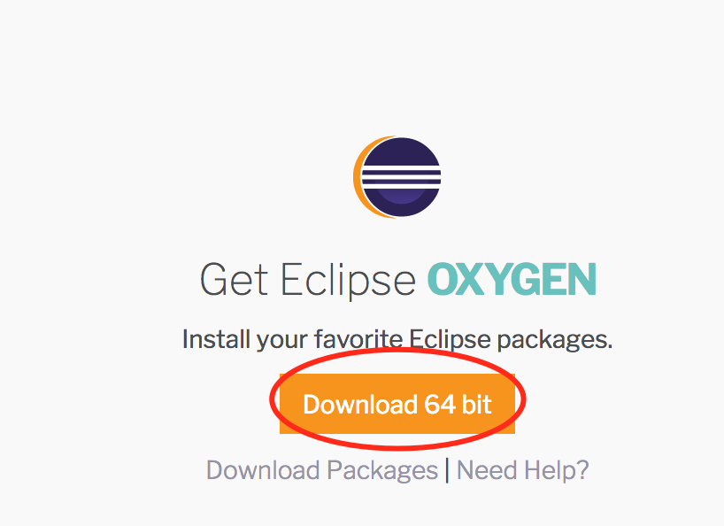
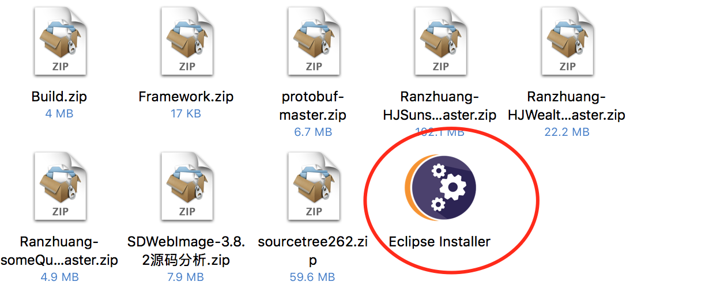
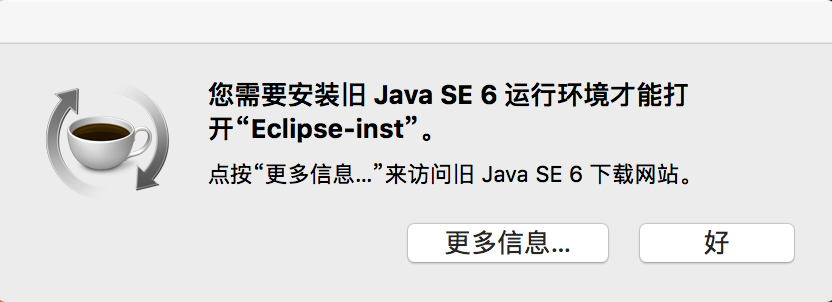
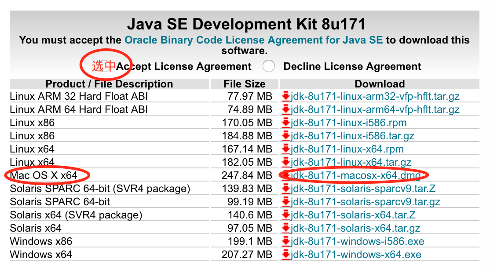
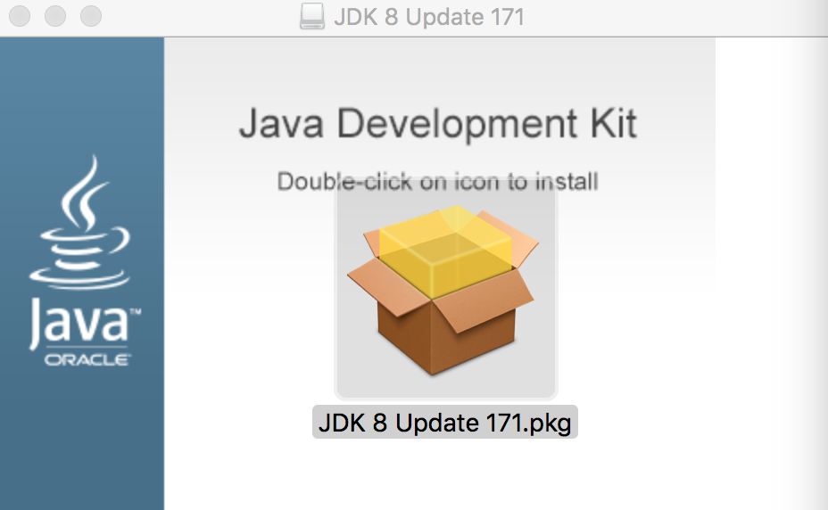
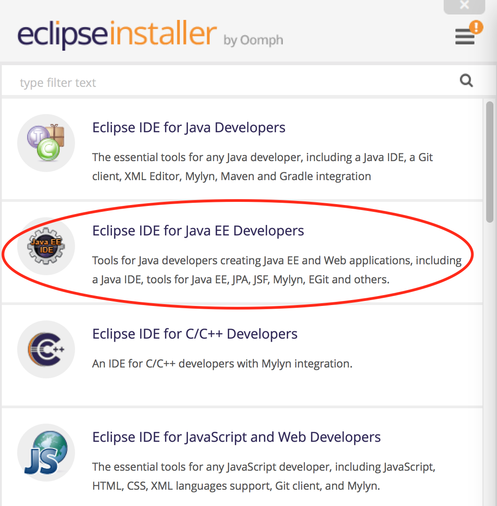
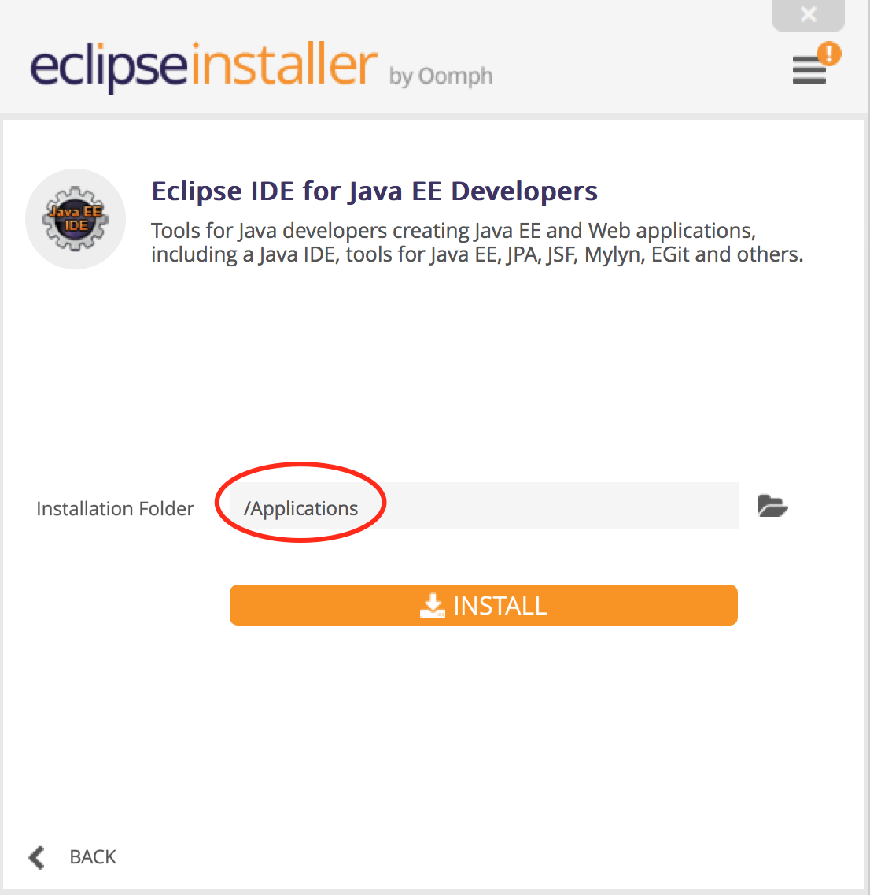

1、 下载Eclipse安装包

地址：[https://www.eclipse.org/downloads/](https://www.eclipse.org/downloads/)

2、在下载中找到下载的压缩文件，里面有个文件叫Eclipse Installer.app,将它解压到当前文件夹

双击Eclipse Installer时会提示需要安装Java的运行环境才能打开Eclipse-inst

此时需要下载java在Mac OS X x64下的jkd, [jkd下载链接](http://www.oracle.com/technetwork/java/javase/downloads/jdk8-downloads-2133151.html),

3、下载jdk

4、安装jdk

在下载中找到下载的jdk，双击进行安装

5、安装Eclipse IDE类型

安装好jdk之后再去Eclipse Installer，此时不会再弹出警告，直接进入installer页，选择Eclipse IDE for Java EE Developers

6、选择安装位置，选择应用程序，点击INSTALL

>接下来，开始了傻瓜式的安装，稍等片刻，Eclipse就将会在"火箭中"出现，正式开启Java之旅吧