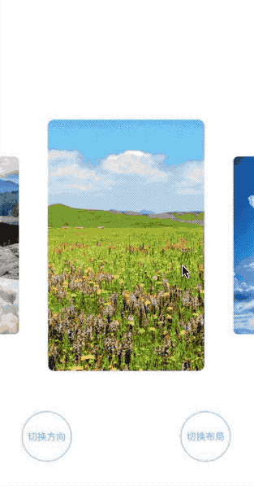
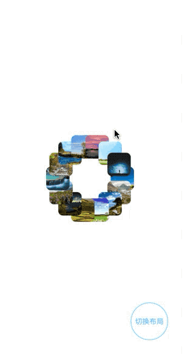

### 涉及布局方式

1、流式布局
2、线性布局
3、圆形布局
4、卡片布局

### 具体布局实现

1、流式布局

1.1   外部可访问的属性

创建布局类继承于UICollectionViewFlowLayout，在自定义布局类中提供一些常用的外部可访问属性，例如：是否垂直滚动、item的宽度和高度、列行间距等，方便进行布局的修改，如下所示

    //MARK: 外部可访问属性

    /// 是否垂直滚动（默认为true）
    var isVerticalStyle = true
    /// 有多少列或者多少行(isVerticalStyle==true代表列，为false代表行)（默认2）
    var columnOrRow:Int = 2

    /// 列间距（默认5）
    var columnSpacing = 5
    /// 行间距（默认5）
    var rowSpacing = 5
    /// 边距（默认都是5）
    var margin = UIEdgeInsets.init(top: 5, left: 5, bottom: 5, right: 5)

    /// item宽度
    var itemWidth:Int?

    /// item高度
    var itemHeight:Int?

2.2 私有属性

提供itemCount、attributesArray、maxYorMaxXArray三个私有属性，其中最关键的是maxYorMaxXArray，是做流式布局的关键，需要在其中去存放对应列的最大Y值（垂直布局）或者对应行的最大X值（水平布局）,如下所示

    //MARK: 私有属性

    /// 多少个item
    private var itemCount:Int?
    /// 每一个layoutAttributes
    private var attributesArray = [UICollectionViewLayoutAttributes]()

    /// item对应行列的最大Y或者最大X，用于做流式布局排版
    private var maxYorMaxXArray = [Int]()

1.3 方法的重写

重写 shouldInvalidateLayout(forBoundsChange newBounds: CGRect) -> Bool，在方法中必须返回false，否则一旦范围发生了改变就会去重新布局，这并不是想要的效果。重写prepare方法，在方法中可以做一些初始化的操作，比如属性的赋值等。重写layoutAttributesForElements(in rect: CGRect) -> [UICollectionViewLayoutAttributes]?，直接返回存放对象的数组，如下所示

    /// 如果返回YES，那么collectionView显示的范围发生改变时，就会重新刷新布局
    /// 一旦重新刷新布局，就会按顺序调用下面的方法：
    /// prepareLayout
    /// layoutAttributesForElementsInRect:
    ///
    /// - Parameter newBounds: newBounds description
    /// - Returns: return value description
    override func shouldInvalidateLayout(forBoundsChange newBounds: CGRect) -> Bool {
        return false
    }

    /// 作用：在这个方法中做一些初始化操作
    /// 注意：一定要调用[super prepareLayout]
    override func prepare() {
        super.prepare()
        self.attributesArray.removeAll()
        self.maxYorMaxXArray.removeAll()
        // 多少行列就存多少个
        for _ in 0..<self.columnOrRow {
            self.maxYorMaxXArray.append(self.isVerticalStyle == true ? Int(self.margin.top):Int(self.margin.left))
        }
        //将每个cell都去调用layoutAttributesForItem方法
        self.itemCount = self.collectionView?.numberOfItems(inSection: 0)
        if self.itemCount != nil {
            for itemI in 0..<self.itemCount! {
                guard let attribute = self.layoutAttributesForItem(at: IndexPath.init(row: itemI, section: 0)) else { return }
                self.attributesArray.append(attribute)
            }
        }
    }

    /// - 这个方法的返回值是个数组
    /// 这个数组中存放的都是UICollectionViewLayoutAttributes对象
    /// UICollectionViewLayoutAttributes对象决定了cell的排布方式（frame等）
    ///
    /// - Parameter rect: rect description
    /// - Returns: return value description
    override func layoutAttributesForElements(in rect: CGRect) -> [UICollectionViewLayoutAttributes]? {
        return self.attributesArray
    }

重写collectionViewContentSize，在方法中需要根据maxYorMaxXArray数组中最后所保存的最大Y或者最大X值来确定内容的size，才能使视图滚动，且能正确的进行滚动。重写layoutAttributesForItem(at indexPath: IndexPath) -> UICollectionViewLayoutAttributes?方法，对每一个item都进行布局，是整个重写布局的关键，在方法中需要对maxYorMaxXArray数组进行修改，来准确的计算出每一个item的宽高以及位置，如下所示

    override var collectionViewContentSize: CGSize {
        var max = self.maxYorMaxXArray[0]
        for (_,value) in self.maxYorMaxXArray.enumerated() {
            if max < value {
                max = value
            }
        }
        if self.isVerticalStyle == true {
            return CGSize.init(width:Int(self.collectionView?.bounds.size.width ?? CGFloat(JJ_SCREEN_WIDTH)), height:max)
        } else {
            return CGSize.init(width:max, height:Int(self.collectionView?.bounds.size.height ?? CGFloat(JJ_SCREEN_HEIGHT)))
        }
    }

    /// 每一个cell的布局
    ///
    /// - Parameter indexPath: indexPath description
    /// - Returns: return value description
    override func layoutAttributesForItem(at indexPath: IndexPath) -> UICollectionViewLayoutAttributes? {
        let attribute = UICollectionViewLayoutAttributes.init(forCellWith: indexPath)
        if self.isVerticalStyle == true {
            /// （width - 左右间距 - 列的margin *（列数-1）） / 列数
            let selfWidth = self.itemWidth ?? Int(self.collectionView?.bounds.size.width ?? CGFloat(JJ_SCREEN_WIDTH))
            let attributeWidth = (selfWidth - Int(self.margin.left) - Int(self.margin.right) - columnSpacing*(self.columnOrRow - 1)) / self.columnOrRow

            var tempHeight = attributeWidth * 2
            if indexPath.row == 1 {
                tempHeight -= 20
            }
            let attributeHeight = self.itemHeight ?? tempHeight

            /// 左间距 + indexPath.row % self.columnOrRow * attributeWidth +  indexPath.row % self.columnOrRow * 列的margin
            let attributeX = Int(margin.left) + indexPath.row % self.columnOrRow * (attributeWidth + columnSpacing)

            // 获取到对应indexPath.row对应行列的当前iatem的Y值
            let attributeY = self.maxYorMaxXArray[indexPath.row % self.columnOrRow]
            attribute.frame = CGRect.init(x: attributeX, y: attributeY, width: attributeWidth, height: attributeHeight)
            // 修改最大值Y,最后两个不是加rowSpacing，而是加maring的bottom距离
            if indexPath.row < self.itemCount! - self.columnOrRow {
                self.maxYorMaxXArray[indexPath.row % self.columnOrRow] = Int(attribute.frame.maxY) + rowSpacing
            } else {
                self.maxYorMaxXArray[indexPath.row % self.columnOrRow] = Int(attribute.frame.maxY) + Int(margin.bottom)
            }
        } else {
             /// （height - 上下间距 - 行的margin *（列数-1）） / 行数
            let selfHeight = self.itemHeight ?? Int(self.collectionView?.bounds.size.height ?? CGFloat(JJ_SCREEN_HEIGHT))
            let attributeHeight = (selfHeight - Int(self.margin.top) - Int(self.margin.bottom) - self.rowSpacing*(self.columnOrRow - 1)) / self.columnOrRow
            var tempWidth = attributeHeight * 2
            if indexPath.row == 1 {
                tempWidth -= 20
            }
            let attributeWidth = self.itemWidth ?? tempWidth
            /// 上间距 + indexPath.row % self.columnOrRow * attributeHeight +  indexPath.row % self.columnOrRow * 行的margin
            let attributeY = Int(margin.top) + indexPath.row % self.columnOrRow * (attributeHeight + rowSpacing)
            // 获取到对应indexPath.row对应行列的当前iatem的X值
            let attributeX = self.maxYorMaxXArray[indexPath.row % self.columnOrRow]
            attribute.frame = CGRect.init(x: attributeX, y: attributeY, width: attributeWidth, height: attributeHeight)
            // 修改最大值X,最后两个不是加ColumnSpacing，而是加maring的right距离
            if indexPath.row < self.itemCount! - self.columnOrRow {
                self.maxYorMaxXArray[indexPath.row % self.columnOrRow] = Int(attribute.frame.maxX) + columnSpacing
            } else {
                self.maxYorMaxXArray[indexPath.row % self.columnOrRow] = Int(attribute.frame.maxX) + Int(margin.right)
            }
        }

        return attribute
    }

1.4 流式布局效果图：

2、线性布局

2.1  配置基本属性

流式布局的方式是可控的，创建子类继承于UICollectionViewFlowLayout，以便实现地控制每个item在屏幕上的位置及大小，模拟出三位布局效果，并且突破线性模式，在自定义子类中提供了4个属性，分别表示宽度、高度、中间值以及滚动方式，如下所示

    //MARK: 外部公开属性
    /// 是否垂直滚动（默认为false）
    var isVerticalStyle = false
    var itemWidth:CGFloat = 250

    var itemHeight:CGFloat = 400

    //MARK: 私有属性
    /// 中间点
    private var midXOrY:CGFloat?

2.2  重写方法

重写shouldInvalidateLayout(forBoundsChange newBounds: CGRect) -> Bool方法并返回true，此时范围发生了改变就会去重新布局，这正是想要的想过。重写prepare方法，进行部分准备工作与赋值操作。重写layoutAttributesForElements(in rect: CGRect) -> [UICollectionViewLayoutAttributes]?方法，处理与rect相交的item，使用CATransform3DMakeScale方法实现形变，如下所示

    //MARK: 重写方法

    override func shouldInvalidateLayout(forBoundsChange newBounds: CGRect) -> Bool {
        return true
    }

    /// 准备
    override func prepare() {
        super.prepare()
        if self.isVerticalStyle == false {
            self.scrollDirection = UICollectionView.ScrollDirection.horizontal
            //水平的情况下中间点为宽度的一半
            self.midXOrY = (self.collectionView?.frame.size.width)! / 2.0
            self.itemSize = CGSize.init(width: self.itemWidth, height:self.itemHeight)
            self.sectionInset = UIEdgeInsets.init(top: 0, left: ((self.collectionView?.frame.size.width)!-self.itemWidth) / 2, bottom: 0, right: ((self.collectionView?.frame.size.width)!-self.itemWidth) / 2)
        } else {
            self.scrollDirection = UICollectionView.ScrollDirection.vertical
            //垂直的情况下中间点为高度度的一半
            self.midXOrY = (self.collectionView?.frame.size.height)! / 2.0
            self.itemSize = CGSize.init(width: self.itemWidth, height: self.itemHeight)
            self.sectionInset = UIEdgeInsets.init(top: ((self.collectionView?.frame.size.height)!-self.itemHeight) / 2, left: 0, bottom: ((self.collectionView?.frame.size.height)!-self.itemHeight) / 2, right: 0)
        }

    }

    override func layoutAttributesForElements(in rect: CGRect) -> [UICollectionViewLayoutAttributes]? {
        guard let array = super.layoutAttributesForElements(in: rect) else {return nil}
        for attributes in array {
            //撤销变化效果，恢复到目前的值，以防止发生不可预料的结果
            attributes.transform3D = CATransform3DIdentity
            //只处理显示的item
            if attributes.frame.intersects(rect) == true {
                //获取contentOffset
                guard let contentOffset = self.collectionView?.contentOffset else {return nil}
                //偏移量到item的中心点的距离
                let itemCenter = CGPoint.init(x: attributes.center.x - contentOffset.x,
                                              y: attributes.center.y - contentOffset.y)
                var distance:CGFloat = 0
                if self.isVerticalStyle == false {
                    //屏幕中心点x到 （偏移量到item的中心点的距离）
                    distance = abs(self.midXOrY! - itemCenter.x)
                } else {
                    distance = abs(self.midXOrY! - itemCenter.y)
                }

                //距离与中心点的比例
                var normalized = distance / self.midXOrY!
                //如果距离大于1就为1
                normalized = min(1.0, normalized)
                //余弦
                let zoom = cos(Double(normalized) * (Double.pi / 4))
                //设置transform
                attributes.transform3D = CATransform3DMakeScale(CGFloat(zoom), CGFloat(zoom), 1.0)
            }
        }
        return array
    }

重写targetContentOffset(forProposedContentOffset proposedContentOffset: CGPoint, withScrollingVelocity velocity: CGPoint) -> CGPoint方法，滚动之后自动的调整位置，调整到想要的某个点，比如item的中心点。注意：此方法的重写达不到分页的效果，下面所示代码表示滚动之后自动调整到离偏移量最近的item的中心点

    /// 滚动之后想要的一个点
    ///
    /// - Parameters:
    ///   - proposedContentOffset: proposedContentOffset description
    ///   - velocity: velocity description
    /// - Returns: return value description
    override func targetContentOffset(forProposedContentOffset proposedContentOffset: CGPoint, withScrollingVelocity velocity: CGPoint) -> CGPoint {
        var offsetAdjustment = CGFloat.greatestFiniteMagnitude
        if self.isVerticalStyle == false {
            //所有item在屏幕上建议的rect
            let targetRect = CGRect.init(x: proposedContentOffset.x, y: 0, width: (self.collectionView?.bounds.size.width)!, height: (self.collectionView?.bounds.size.height)!)
            guard let array = super.layoutAttributesForElements(in: targetRect) else {return CGPoint.zero}
            //滚动之后屏幕的中心点坐标为滚动距离 + midXOrY
            let proposedCenterX = proposedContentOffset.x + midXOrY!
            //便利数组，找到离滚动之后的屏幕中心点最近的一个item，并记录下他们之间的距离
            for attribute in array {
                let distance = attribute.center.x - proposedCenterX
                if abs(distance) < abs(offsetAdjustment) {
                    offsetAdjustment = distance
                }
            }

            //想要的中心点 滚动之后的中心点+到最近的一个item中心点的距离 为目标的中心点
            let desiredPoint = CGPoint.init(x: proposedContentOffset.x + offsetAdjustment, y: proposedContentOffset.y)
            //解决两端
            if proposedContentOffset.x == 0 ||
                proposedContentOffset.x >= self.collectionViewContentSize.width - (self.collectionView?.bounds.size.width)!{
                return proposedContentOffset
            }

            //将内容偏移到中心所需的最小值
            return desiredPoint
        } else {
            //所有item在屏幕上建议的rect
            let targetRect = CGRect.init(x:0, y: proposedContentOffset.y, width: (self.collectionView?.bounds.size.width)!, height: (self.collectionView?.bounds.size.height)!)
            guard let array = super.layoutAttributesForElements(in: targetRect) else {return CGPoint.zero}
            //滚动之后屏幕的中心点坐标为滚动距离 + midXOrY
            let proposedCenterY = proposedContentOffset.y + midXOrY!
            //便利数组，找到离滚动之后的屏幕中心点最近的一个item，并记录下他们之间的距离
            for attribute in array {
                let distance = attribute.center.y - proposedCenterY
                if abs(distance) < abs(offsetAdjustment) {
                    offsetAdjustment = distance
                }
            }

            //想要的中心点 滚动之后的中心点+到最近的一个item中心点的距离 为目标的中心点
            let desiredPoint = CGPoint.init(x: proposedContentOffset.x, y: proposedContentOffset.y  + offsetAdjustment)
            //解决两端
            if proposedContentOffset.y == 0 ||
                proposedContentOffset.y >= self.collectionViewContentSize.height - (self.collectionView?.bounds.size.height)!{
                return proposedContentOffset
            }

            //将内容偏移到中心所需的最小值
            return desiredPoint
        }

    }

2.3 实现分页功能

在有UICollectionView的视图中遵守UICollectionViewDelegate协议，并实现scrollViewWillBeginDragging(_ scrollView: UIScrollView)与scrollViewDidEndDragging(_ scrollView: UIScrollView, willDecelerate decelerate: Bool)方法。在scrollViewWillBeginDragging方法中记录下contentoffset的x和y值为开始值，在scrollViewDidEndDragging方法中也记录下contentoffset的x和y值为结束值，对其进行减运算操作，对值进行判断以实现下标的加减操作方便对视图进行滚动，如下所示

    //用于控制分页
    private var currentIndex:Int = 0
    private var startX:CGFloat = 0
    private var startY:CGFloat = 0
    private var endX:CGFloat = 0
    private var endY:CGFloat = 0
    /// 设置最小的滚动距离
    private let minScrollDistance:CGFloat = 100

    func scrollViewWillBeginDragging(_ scrollView: UIScrollView) {
        if (self.currentLayout as? JJLine3DFlowLayout) != nil {
            self.startX = scrollView.contentOffset.x
            self.startY = scrollView.contentOffset.y
        }
    }

    func scrollViewDidEndDragging(_ scrollView: UIScrollView, willDecelerate decelerate: Bool) {
        if (self.currentLayout as? JJLine3DFlowLayout) != nil {
            self.endX = scrollView.contentOffset.x
            self.endY = scrollView.contentOffset.y
            DispatchQueue.main.async {
                self.dealScroll()
            }
        }
    }

    private func dealScroll() {
        //minScrollDistance最小的滚动距离，可自己设定，此处值为100
        if self.endX - self.startX >= self.minScrollDistance {
            self.currentIndex += 1 //左滑看下一张
        } else if self.startX - self.endX >= self.minScrollDistance {
            self.currentIndex -= 1 //右滑看上一张
        }

        if self.endY - self.startY >= self.minScrollDistance {
            self.currentIndex += 1 //上滑看下一张
        } else if self.startY - self.endY >= self.minScrollDistance {
            self.currentIndex -= 1 //下滑看上一张
        }

        self.currentIndex = self.currentIndex <= 0 ? 0 : self.currentIndex
        self.currentIndex = self.currentIndex >= self.sourceArray!.count - 1 ? self.sourceArray!.count - 1 : self.currentIndex

        if let layout = self.currentLayout as? JJLine3DFlowLayout {
            if layout.isVerticalStyle == false {
                self.contentView.scrollToItem(at: IndexPath.init(row: self.currentIndex, section: 0), at: UICollectionView.ScrollPosition.centeredHorizontally, animated: true)
            } else {
                self.contentView.scrollToItem(at: IndexPath.init(row: self.currentIndex, section: 0), at: UICollectionView.ScrollPosition.centeredVertically, animated: true)
            }
        }

    }

2.4 线性布局效果图：

3、圆形布局

3.1  基本属性

创建子视图继承与UICollectionViewFlowLayout，提供item的宽高、半径、中心点等基本属性，提供开始角度、结束角度、捏合程度等属性记录旋转与捏合手势的值，如下所示

    //MARK: 可访问属性
    var itemWidth = 50
    var itemHeight = 50

    //MARK: 私有属性
    /// 开始的角度
    private var startRotation:CGFloat = 0
    /// 结束的角度
    private var endRotation:CGFloat = 0
    /// 捏合程度
    private var scaled:CGFloat = 0
    private var numberOfItem:Int = 0
    /// 半径
    private var radius:CGFloat = 0
    /// 中心点
    private var centerPoint:CGPoint = CGPoint.zero

3.2  重写方法

重写shouldInvalidateLayout(forBoundsChange newBounds: CGRect) -> Bool方法，返回false。重写prepare方法进行属性赋值。重写collectionViewContentSize: CGSize方法设置内容size。重写layoutAttributesForElements(in rect: CGRect) -> [UICollectionViewLayoutAttributes]?并在其中调用self.layoutAttributesForItem方法。重写layoutAttributesForItem(at indexPath: IndexPath) -> UICollectionViewLayoutAttributes?方法，对每个item进行布局，并加入旋转与捏合值，如下所示

    //MARK: 重写方法

    override func prepare() {
        super.prepare()
        self.numberOfItem = (self.collectionView?.numberOfItems(inSection: 0))!
        self.radius = (self.collectionView?.bounds.width)! / 3
        self.centerPoint = CGPoint.init(x: (self.collectionView?.bounds.width)! / 2, y: (self.collectionView?.bounds.height)! / 2)
    }

    override func shouldInvalidateLayout(forBoundsChange newBounds: CGRect) -> Bool {
        return false
    }

    override var collectionViewContentSize: CGSize {
        return (self.collectionView?.bounds.size)!
    }

    override func layoutAttributesForElements(in rect: CGRect) -> [UICollectionViewLayoutAttributes]? {
        var array = [UICollectionViewLayoutAttributes]()
        for i in 0..<self.numberOfItem {
            guard let attribute = self.layoutAttributesForItem(at: IndexPath.init(row: i, section: 0)) else {return nil}
            array.append(attribute)
        }
        return array
    }

    override func layoutAttributesForItem(at indexPath: IndexPath) -> UICollectionViewLayoutAttributes? {
        let attribute = UICollectionViewLayoutAttributes.init(forCellWith: indexPath)
        //        //进度
        //        let progress = CGFloat(indexPath.item) / CGFloat(self.numberOfItem)
        //        //theta
        //        let theta = CGFloat(2.0 * Double.pi * Double(progress))
        //        let xPoint = centerPoint.x + self.radius * cos(theta)
        //        let yPoint = centerPoint.y + self.radius * sin(theta)
        //
        //        attribute.center = CGPoint.init(x: xPoint, y: yPoint)
        //        attribute.size = CGSize.init(width: itemWidth, height: itemHeight)

        //-------------------  加入旋转、捏合手势后 ----------------//
        //进度
        let progress = CGFloat(indexPath.item) / CGFloat(self.numberOfItem)
        //theta
        let theta = CGFloat(2.0 * Double.pi * Double(progress))
        //旋转之后的角度
        let rotatedTheta = theta  + self.startRotation + self.endRotation
        //捏合之后的半径
        let scaledRadius = min(max(scaled, 0.5), 1.3) * radius

        let xPoint = centerPoint.x + scaledRadius * cos(rotatedTheta)
        let yPoint = centerPoint.y + scaledRadius * sin(rotatedTheta)

        attribute.center = CGPoint.init(x: xPoint, y: yPoint)
        attribute.size = CGSize.init(width: itemWidth, height: itemHeight)

        return attribute
    }

3.3 提供外部方法用于捏合、旋转值的传入

需要注意的是如果旋转操作正在进行，那么就根据当前的旋转角度来进行跟新，如果旋转操作已经结束了，那么需要将当前的旋转角度置为0（也就是startRotation的值），这样在下次旋转时就能从新的基准值开始计算了，才不会出现错误的起始值

    //MARK: 公共方法

    /// 从哪里选装
    ///
    /// - Parameter theta: theta description
    func rotateBy(theta:CGFloat) {
        self.startRotation = theta
    }

    /// 旋转结束
    ///
    /// - Parameter theta: theta description
    func rotateTo(theta:CGFloat) -> Void {
        //将旋转结束值相加，然后让startRotation为0，下一次旋转开始才会是正确的起始值
        self.endRotation += theta
        self.startRotation = 0
    }

    /// 缩放比例
    ///
    /// - Parameter factor: factor description
    func scaleTo(factor:CGFloat) -> Void {
        self.scaled = factor
    }

3.4 为UICollectionView添加手势并实现方法

        //添加旋转手势
        let rotationGesture = UIRotationGestureRecognizer.init(target: self, action: #selector(self.totate(rotationGesture:)))
        self.contentView.addGestureRecognizer(rotationGesture)
        //添加捏合手势
        let pichGesture = UIPinchGestureRecognizer.init(target: self, action: #selector(piched(pichGesture:)))
        self.contentView.addGestureRecognizer(pichGesture)

    /// 旋转手势识别处理
    ///
    /// - Parameter rotationGesture: rotationGesture description
    @objc func totate(rotationGesture: UIRotationGestureRecognizer) ->Void {
        if let temp = self.currentLayout as? JJCircleFlowLayout {
            if rotationGesture.state == UIGestureRecognizer.State.ended {
                temp.rotateTo(theta: rotationGesture.rotation)
            } else {
                temp.rotateBy(theta:  rotationGesture.rotation)
            }
            self.currentLayout?.invalidateLayout()
        }

    }

    /// 捏合手势处理
    ///
    /// - Parameter pichGesture: pichGesture description
    @objc func piched(pichGesture:UIPinchGestureRecognizer) -> Void {
        if let temp = self.currentLayout as? JJCircleFlowLayout {
            temp.scaleTo(factor: pichGesture.scale)
            self.currentLayout?.invalidateLayout()
        }
    }

3.5 圆形布局效果图:

4、卡片布局

4.1 布局分析

卡片布局主要是明确中心点、根据indexPath来修改item的大小以及偏移值，通常情况下卡片只显示前面少量的几张，其他的卡片会先进行隐藏，当上面的卡片删除之后再去显示下面的卡片，如下所示

    //MARK: 可访问属性
    var itemWidth = 350
    var itemHeight = 350

    //MARK: 私有属性
    /// 中心点
    private var centerPoint:CGPoint = CGPoint.zero
    private var numberOfItem:Int = 0

    //MARK: 重写方法

    override func prepare() {
        super.prepare()
        self.centerPoint = CGPoint.init(x: (self.collectionView?.bounds.width)! / 2, y: (self.collectionView?.bounds.height)! / 2)
        self.numberOfItem = (self.collectionView?.numberOfItems(inSection: 0))!

    }

    override var collectionViewContentSize: CGSize {
        return (self.collectionView?.bounds.size)!
    }

    override func layoutAttributesForElements(in rect: CGRect) -> [UICollectionViewLayoutAttributes]? {
        var array = [UICollectionViewLayoutAttributes]()
        for i in 0..<self.numberOfItem {
            guard let attribute = self.layoutAttributesForItem(at: IndexPath.init(row: i, section: 0)) else {return nil}
            array.append(attribute)
        }
        return array
    }

    override func layoutAttributesForItem(at indexPath: IndexPath) -> UICollectionViewLayoutAttributes? {
        let attribute = UICollectionViewLayoutAttributes.init(forCellWith: indexPath)
        //    NSArray *offsetArray = @[@(0.0), @(15.0), @(30.0)];

        attribute.center = self.centerPoint
        attribute.size = CGSize.init(width: itemWidth - 15 * indexPath.item, height: itemHeight)
        // 改变z值 zIndex值越大,图片越在上面(所以显示的第一个的item为0)
        attribute.zIndex = self.numberOfItem - indexPath.item;
        // 改变偏移值
        attribute.transform = CGAffineTransform.init(translationX: 0, y: CGFloat(indexPath.item * 15))
        if attribute.indexPath.item > 3 {
            attribute.isHidden = true
        }
        return attribute
    }

4.2 卡片布局效果图:

>项目地址：[知识集结点](https://dev.tencent.com/u/Ranzhuang/p/yigeSwiftxiangmu)
