### 创建Web工程

1、选择"File"--->"New"--->"Project"，如图所示：

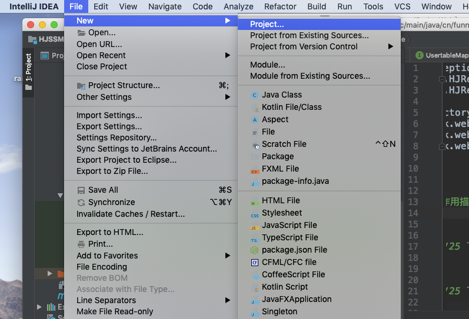

2、在弹出的视图左侧选择"Maven"，右侧选择SDK，并勾选上"Create from archetype"选择框，选择"org.apache.maven.archetypes:maven-archetype-webapp"，如图所示：

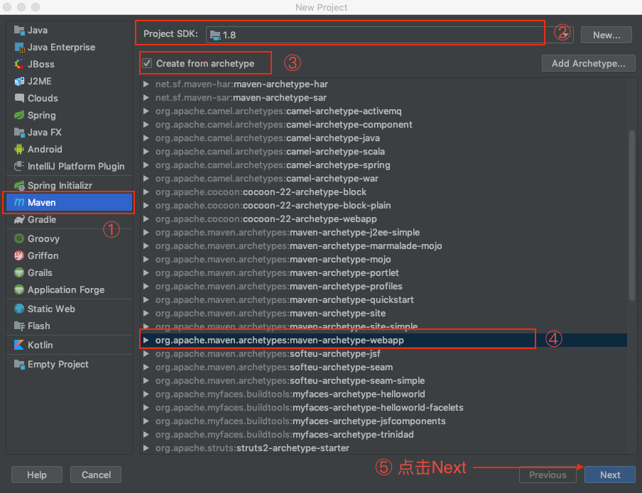

3、在视图中输入GroupId、ArtifactId的名称，如图所示：

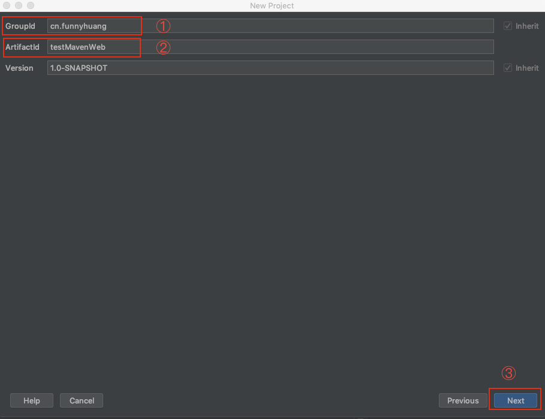

4、视图中主要包含Maven的路径，用户设置文件的路径、repository的路径，可以不做修改，直接点击"Next"

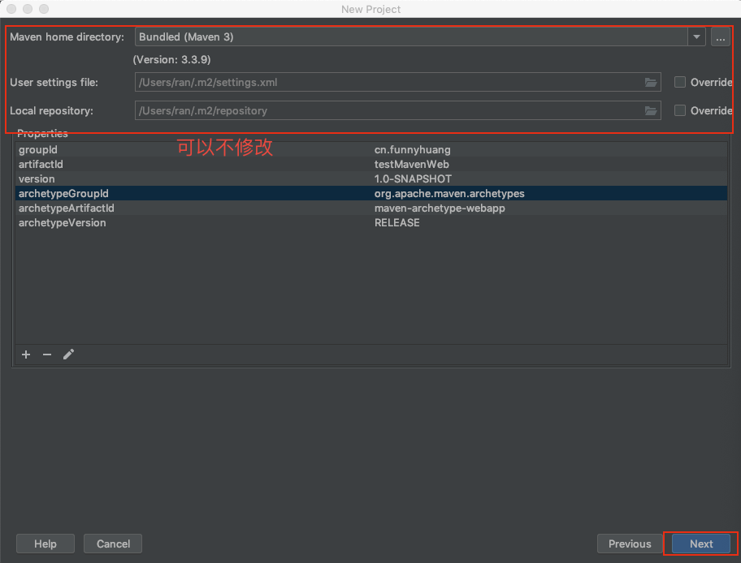

5、 在弹出的视图中可以设置工程名字、工程的路径等信息，修改完成点击"Finish"，完成创建

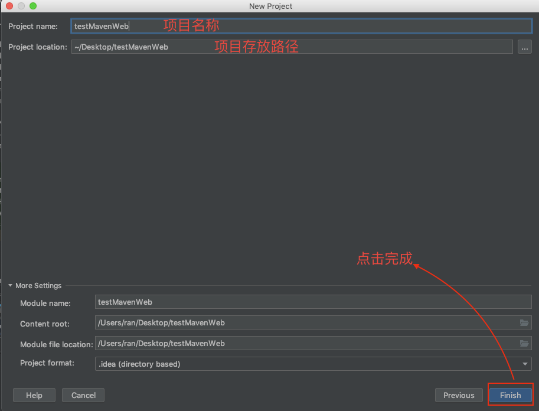

Maven所创建的Web工程目录结构图展示:

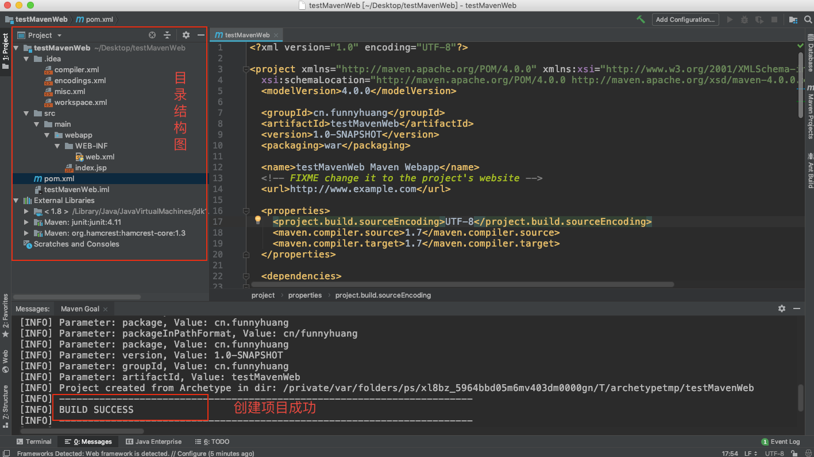

### 查看并修改工程结构

点击"File"--->选择"Project Structure..."弹出工程结构视图，选择左侧的"Modules"标签，如图进行设置

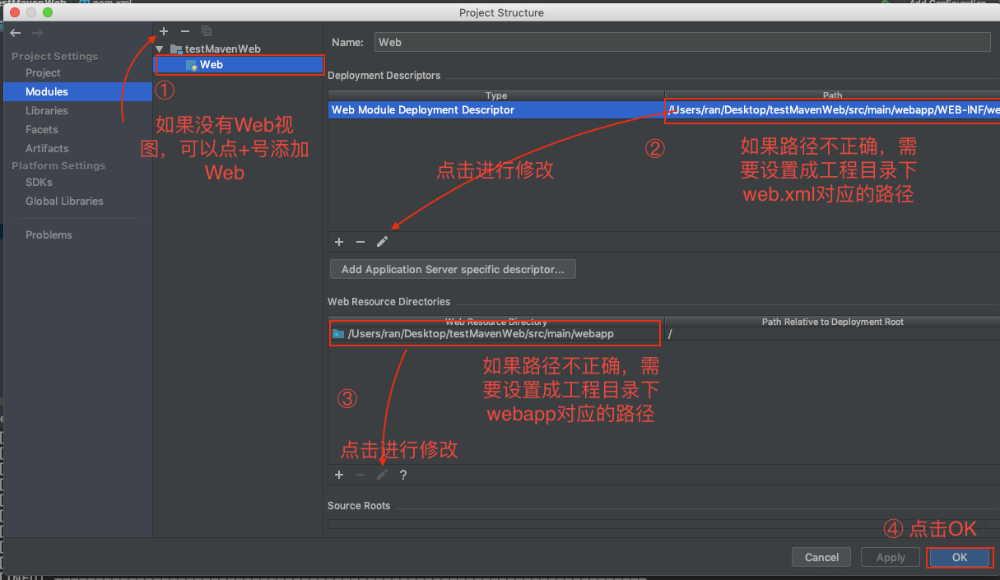

选择左侧的"Artifacts"标签，如图进行设置

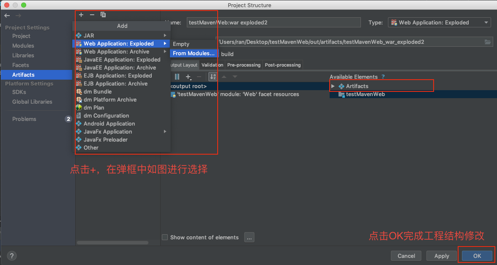

### 设置Tomcat

点击"Run"菜单项--->点击"Edit Configurations..."弹出配置视图，点击视图左上角的"+"添加本地的Tomcat，如图所示

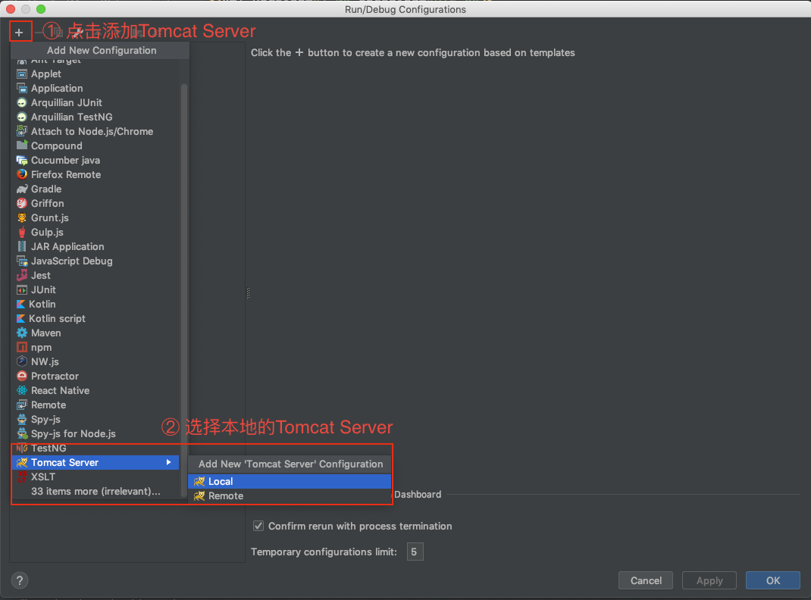

配置Tomcat Server，主要是配置Tomcat Server的名字和服务器的版本，如图所示

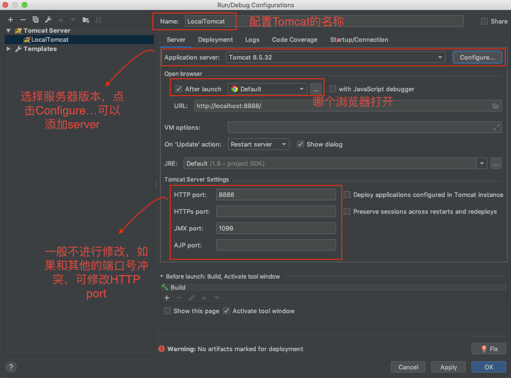

部署项目，依然是在配置视图中，选择"Deployment"标签，如图进行工程部署

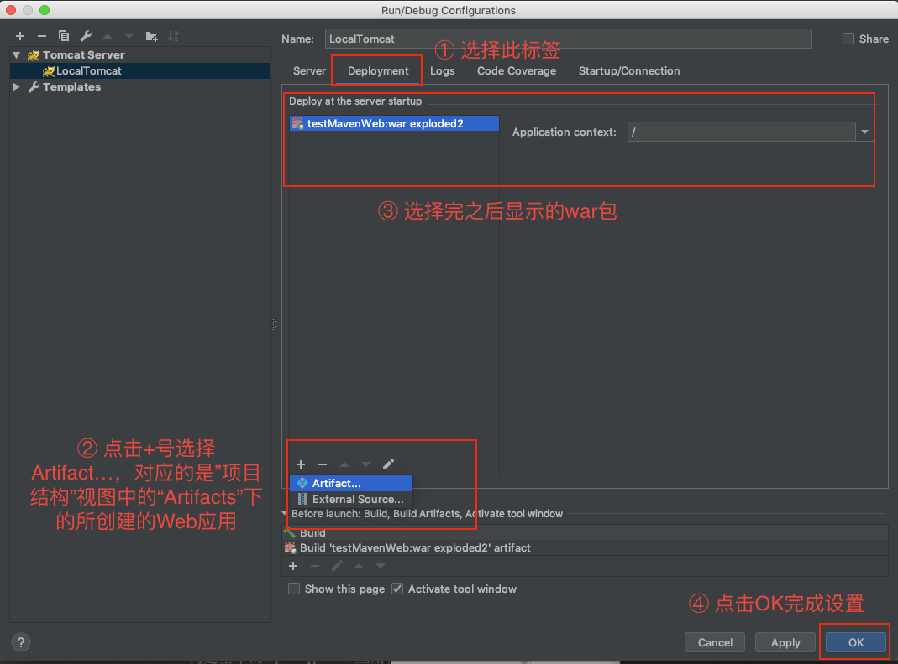

>运行项目，在网页中出现"Hello World!"字样，项目就部署成功了

### SSM框架目录结构搭建

在"图6"中展示了Maven创建Web工程的目录结构，发现太过于简单，需要创建更多的路径以及包，使项目看起来更加的清晰，更加有利于维护，下图将展示一个较为简单的SSM目录结构

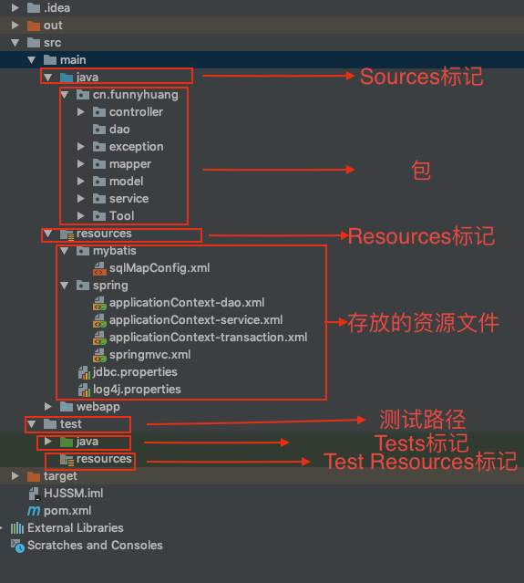

在idea中，点击"File"--->选择"Project Structure..."，可在Project Structure视图中的"Modules"标签中去进行文件夹的标记，如图所示

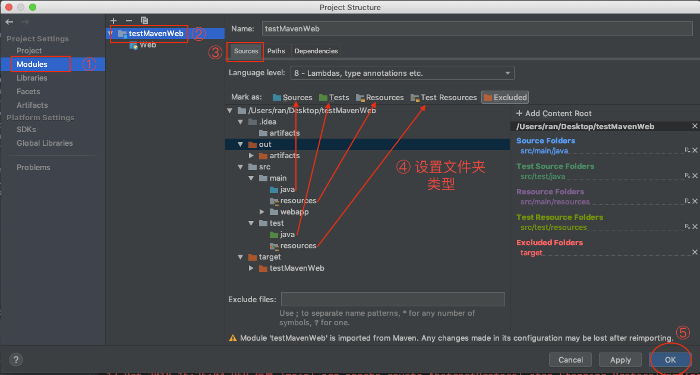

>写在最后
>
>在idea开发maven项目的时候，如果resources路径配置不正确，可能会导致无法找到xml配置文件，从而无法成功注入bean。此时，可以在pom.xml里的"build"标签中添加如下代码：

	<resources>
      <resource>
        <directory>src/main/java</directory>
        <includes>
          <include>**/*.xml</include>
        </includes>
      </resource>
    </resources>
