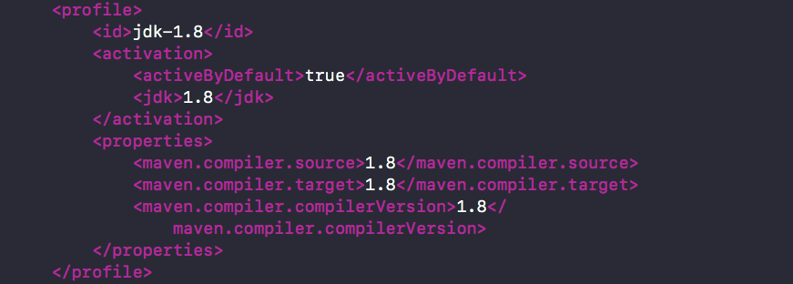
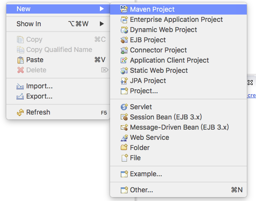
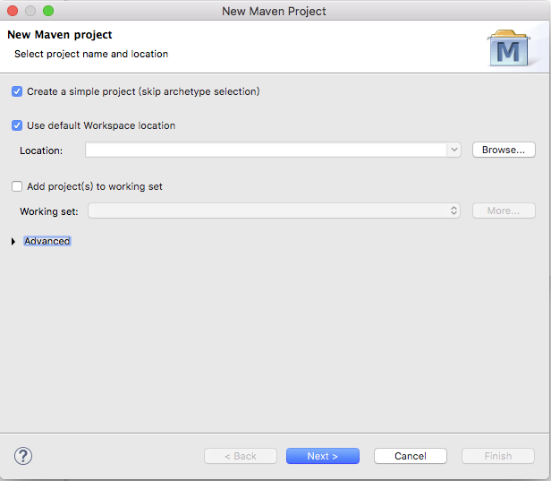
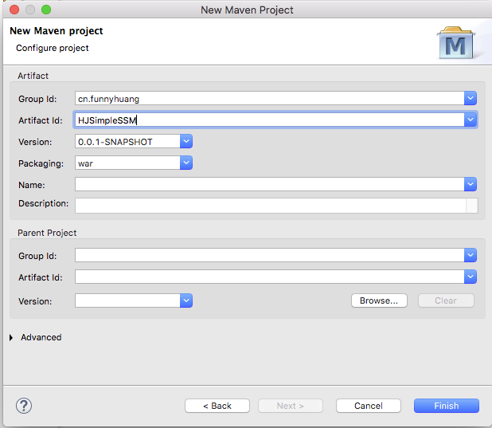
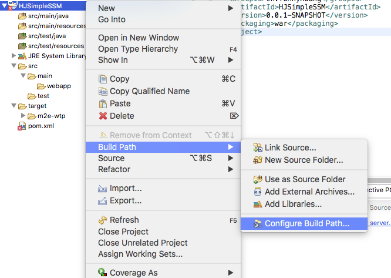
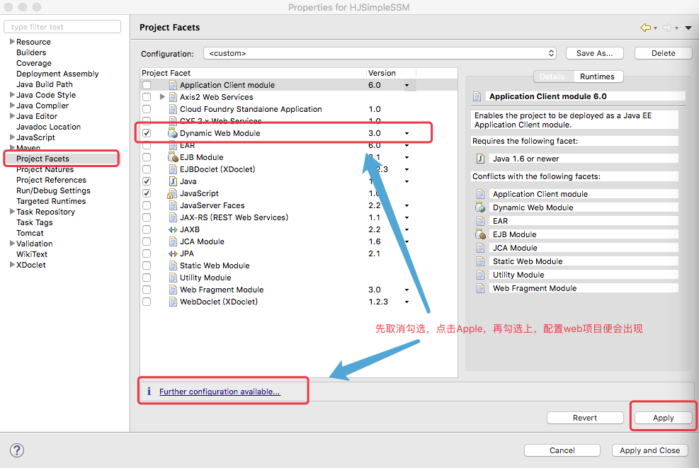
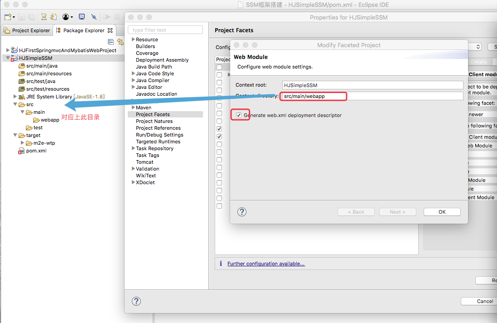
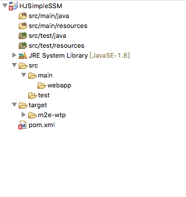

### Maven创建Web项目

1、setting.xml配置修改

在使用Maven创建Web项目之前需要先确认所创建的Web工程的JRE System Library，点击Eclipse-->Preferences-->Maven-->User Settings，需要在setting.xml中的<profiles>标签中去进行配置，此处将 JRE System Library配置成1.8

```
<profile>
        <id>jdk-1.8</id>
        <activation>
            <activeByDefault>true</activeByDefault>
            <jdk>1.8</jdk>
        </activation>
        <properties>
            <maven.compiler.source>1.8</maven.compiler.source>
            <maven.compiler.target>1.8</maven.compiler.target>
            <maven.compiler.compilerVersion>1.8</maven.compiler.compilerVersion>
        </properties>
    </profile>
```
如图所示：


2、创建Web项目

在 Package Explorer中右击空白区，选择New-->Maven Project


在窗口中勾选"Create a simple project"-->Next


输入Group Id,Artifact Id,选择packagin为"war"，点击Finish，便可以创建Maven所认为的Web工程


3、修改项目配置

在创建Maven工程时选择打包为war包，Maven就认为是Maven工程，但是在eclipse此时并不认为此工程是一个Web工程，需要对工程进行配置的修改，右击项目-->Build Path ->Cconfigure Build Path...


在窗口中选择Project Facets，去掉"Dynamic Web Module"勾选，点击"Apply"，然后再次勾选"Dynamic Web Module"，这样就可以去配置Web项目，如图所示：


点击 "Further configuration available...",在窗口中修改"Content directory"并勾选上"Generate web.xml deployment descriptor"，如图所示：


配置好之后选择"ok"，选择 "Apply and close"，观察工程目录结构，便发生了变化，此时ecplise也认为此工程是一个Web工程。
前后工程目录对比图：


