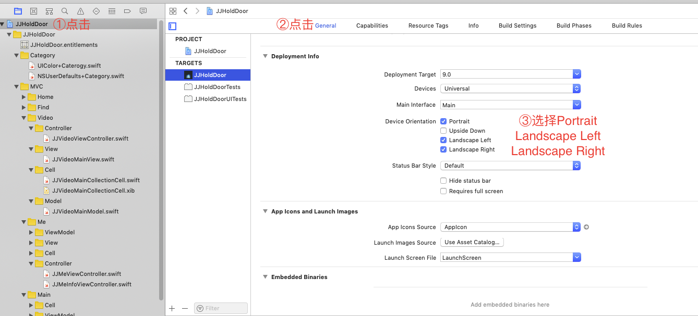

### 涉及知识点

1、基于UIViewController构建基础控制器
2、基于UINavigationController构建导航控制器并添加Pop手势
3、基于UITabBarController构建主控制器
4、指定控制器可进行设备方向翻转

### 具体实现

1、基于UIViewController构建基础控制器

1.1 自定义导航栏

在定制导航栏中所包含的内容时，主要是考虑绝大部分控制器所需要的控件，所以通常包含左返回按钮，标题视图以及标题，右侧设置按钮。部分iPhone手机带有刘海，statusBar的高度也不再是以前的20，所以更好做法是将导航视图分为statusBar高度的视图和其他视图，一起构成导航视图。如下所示

    // MARK: set & get 方法

    /// navigationView
    lazy var navigationView: UIView = {
        let navigationView = UIView.init(frame: CGRect.zero)
        navigationView.backgroundColor = UIColor.white
        navigationView.addSubview(self.statusView)
        navigationView.addSubview(self.moreNaviView)
        navigationView.addSubview(self.lineView)
        return navigationView
    }()
    /// 去除状态栏剩余view
    lazy var moreNaviView: UIView = {
        let moreNaviView = UIView.init(frame: CGRect.zero)
        view.backgroundColor = UIColor.white
        moreNaviView.addSubview(self.titleView)
        return moreNaviView
    }()
    /// 状态栏高度的视图
    lazy var statusView: UIView = {
        let statusView = UIView.init(frame: CGRect.zero)
        statusView.backgroundColor = UIColor.white
        return statusView
    }()

    lazy var backButton: UIButton = {
        let button = UIButton.init(frame: CGRect.init(x: 10, y: 0, width: 100, height: 44))
        button.setTitle("返回", for: .normal)
        button.setTitleColor(UIColor.black, for: .normal)
        button.setTitleColor(UIColor.lightGray, for: .highlighted)
        button.titleLabel?.font = UIFont.systemFont(ofSize: 16)
        button.setImage(UIImage.init(named: "黑色向左箭头"), for: .normal)
        button.setImage(UIImage.init(named: "向左箭头"), for: .highlighted);
        button.titleLabel?.adjustsFontSizeToFitWidth = true
        button.contentHorizontalAlignment = .left
        button.titleEdgeInsets = UIEdgeInsets.init(top: 0, left: 5, bottom: 0, right: 0)
        button.addTarget(self, action: #selector(backButtonDidClicked(button:)), for: .touchUpInside)
        return button
    }()

    lazy var rightButton: UIButton = {
        let button = UIButton.init(type: UIButton.ButtonType.custom)
        button.setTitleColor(UIColor.black, for: UIControl.State.normal)
        button.setTitleColor(UIColor.lightGray, for: .highlighted)
        button.titleLabel?.font = UIFont.systemFont(ofSize: 16)
        button.titleLabel?.adjustsFontSizeToFitWidth = true
        button.titleLabel?.contentMode = UIView.ContentMode.center
        button.addTarget(self, action: #selector(rightButtonDidClicked(button:)), for: .touchUpInside)
        return button
    }()

    lazy var lineView: UIView = {
        let lineView = UIView.init(frame: CGRect.zero)
        lineView.backgroundColor = UIColor.gray
        return lineView
    }()

    // MARK: 私有 set & get 方法

    private lazy var titleView: UIView = {
        let titleView = UIView.init(frame: CGRect.zero)
        titleView.addSubview(self.titleLabel)
        return titleView
    }()

    private lazy var titleLabel :UILabel =  {
        let label = UILabel.init(frame: CGRect.zero)
        label.font = UIFont.systemFont(ofSize: 16)
        label.adjustsFontSizeToFitWidth = true
        label.textAlignment = .center
        return label
    }()

1.2 添加导航栏视图并布局

可在控制器中重写viewDidLoad()方法，进行视图的添加，需要注意的是自定义导航栏视图部分控件的frame不能写死，需要实现自动布局，否则在某些指定的控制器中实现设备方向翻转时导航视图会出现frame问题，使用的布局框架是SnapKit，布局如下所示

    //MARK: 重写的方法和属性
    override func viewDidLoad() {
        super.viewDidLoad()
        // 添加基本视图
        self.configBaseUI()

    }

    // MARK: 本类公共方法
    /// 设置UI
    private func configBaseUI() {
        self.view.backgroundColor = UIColor.colorWithHex(rgb: 0xb2b2b2)
        self.view.addSubview((self.navigationView))
        self.view.bringSubviewToFront(self.navigationView)
        self.makeConstraint()
    }

    /// 约束
    private func makeConstraint() {
        self.navigationView.snp.makeConstraints { (make) in
            make.left.equalToSuperview()
            make.right.equalToSuperview()
            make.top.equalToSuperview()
            make.height.equalTo(JJ_NAVIGATION_HEIGHT)
        }
        self.statusView.snp.makeConstraints { (make) in
            make.left.equalToSuperview()
            make.right.equalToSuperview()
            make.top.equalToSuperview()
            make.height.equalTo(JJ_STATUS_HEIGHT)
        }
        self.moreNaviView.snp.makeConstraints { (make) in
            make.left.equalToSuperview()
            make.right.equalToSuperview()
            make.top.equalTo(JJ_STATUS_HEIGHT)
            make.height.equalTo(JJ_NAVIGATION_MOREHEIGHT)
        }
        self.lineView.snp.makeConstraints { (make) in
            make.left.equalToSuperview()
            make.right.equalToSuperview()
            make.top.equalTo(JJ_NAVIGATION_HEIGHT - 1)
            make.height.equalTo(1)
        }
        self.titleView.snp.makeConstraints { (make) in
            make.left.equalToSuperview().offset(100)
            make.right.equalToSuperview().offset(-100)
            make.top.equalToSuperview()
            make.height.equalToSuperview()
        }
        self.titleLabel.snp.makeConstraints { (make) in
            make.left.equalToSuperview()
            make.right.equalToSuperview()
            make.top.equalToSuperview()
            make.height.equalToSuperview()
        }
    }

在做布局时使用到了JJ_NAVIGATION_HEIGHT、JJ_STATUS_HEIGHT、JJ_NAVIGATION_MOREHEIGHT等常量，主要作用是需要做屏幕适配（关于适配方面的问题，可以参考[iPhone X 屏幕适配从选择到 "放弃"](https://funnyhuang.cn/2018/07/04/%E9%80%82%E9%85%8D/)），涉及到的3个常量如下所示：

      /// iphone x/xs/xsMax/xr 44, 其他20    iphonex/xs: 375.f, 812.f iphonexr/xsMax: 414.f, 896.f
        let JJ_STATUS_HEIGHT = ((__CGSizeEqualToSize(CGSize.init(width: 375, height: 812), UIScreen.main.bounds.size) == true ||
                         __CGSizeEqualToSize(CGSize.init(width: 812, height: 375),
      UIScreen.main.bounds.size) == true ||
                         __CGSizeEqualToSize(CGSize.init(width: 414, height: 896),
      UIScreen.main.bounds.size) == true ||
                         __CGSizeEqualToSize(CGSize.init(width: 896, height: 414),
      UIScreen.main.bounds.size) == true)
                        ? 44 : 20)

      /// navigation除掉status的高度
      let JJ_NAVIGATION_MOREHEIGHT = (44)

      /// navigation高度
      let JJ_NAVIGATION_HEIGHT = (JJ_STATUS_HEIGHT +
      JJ_NAVIGATION_MOREHEIGHT)

1.3  状态栏的控制

有时需要对状态栏显示的状态以及是否隐藏状态栏进行控制，但是对应的"preferredStatusBarStyle"与"prefersStatusBarHidden"属性只提供了get，而不能进行set，所以需要重写对应的属性，实现对状态栏的控制

    // MARK: 属性

    /// 状态栏状态
    private var _statusBarStyle:UIStatusBarStyle?
    /// 状态栏状态
    var statusBarStyle: UIStatusBarStyle? {
        get {
            return _statusBarStyle
        }
        set {
            _statusBarStyle = newValue
            self.setNeedsStatusBarAppearanceUpdate()
        }
    }
    /// 是否隐藏状态栏
    private var _statusBarHidden:Bool?
    /// 是否隐藏状态栏
    var statusBarHidden: Bool? {
        get {
            return _statusBarHidden
        }
        set {
            _statusBarHidden = newValue;
            self.setNeedsStatusBarAppearanceUpdate()
        }
    }

    //MARK: 重写的方法和属性
    override var preferredStatusBarStyle: UIStatusBarStyle {
        if self.statusBarStyle != nil {
            return self.statusBarStyle!
        }
        return super.preferredStatusBarStyle
    }

    override var prefersStatusBarHidden: Bool {
        if self.statusBarHidden != nil {
            return self.statusBarHidden!
        }
        return super.prefersStatusBarHidden
    }

1.4  方法调用

在基础控制器中应当提供常用的方法，用于方便子控制器来进行调用，提高效率，比如说导航栏的基本设置、颜色、文字等，需要注意的是按钮点击的方法需要加上 @objc才能公开给Objective-C，如下所示

    // MARK: 子类调用方法

    /// 导航栏基本设置
    func defaultNavigation() {
        self.setNavigation(color: UIColor.white)
        self.statusBarStyle = .default
        self.setNavigation(titleColor: UIColor.black)
    }

    /// 设置导航栏背景色
    func setNavigation(color:UIColor) {
        self.navigationView.backgroundColor = color
        self.moreNaviView.backgroundColor = color
        self.statusView.backgroundColor = color
    }
    /// 设置导航栏文字
    func setNavigation(title: String) {
        self.setNavigation(title: title, titleColor: nil)
    }

    /// 设置导航栏文字颜色
    ///
    /// - Parameter titleColor: titleColor description
    func setNavigation(titleColor:UIColor) {
        self.setNavigation(title: nil, titleColor: titleColor)
    }
    /// 设置导航栏文字和文字颜色
    func setNavigation(title: String?, titleColor:UIColor?) {
        self.titleLabel.text = title ?? ""
        self.titleLabel.textColor = titleColor ?? UIColor.black
    }
    /// 设置导航栏文字和导航栏颜色
    func setNavigation(color:UIColor, title:String) {
        self.setNavigation(color: color)
        self .setNavigation(title: title)
    }
    /// 添加返回按钮
    func addBackButton() {
        self.moreNaviView.addSubview(self.backButton)
    }

    /// 添加右侧按钮
    ///
    /// - Parameters:
    ///   - title: title description
    ///   - titleColor: titleColor description
    ///   - imageName: imageName description
    func addRightButton(title:String?, titleColor:UIColor?, imageName:String? ) {
        self.rightButton.setTitle(title, for: UIControl.State.normal)
        self.rightButton.setTitleColor(titleColor, for: UIControl.State.normal)
        self.rightButton.setImage(UIImage.init(named: imageName ?? ""), for: UIControl.State.normal)
        self.moreNaviView.addSubview(self.rightButton)
        self.rightButton.snp.makeConstraints { (make) in
            make.width.equalTo(JJ_NAVIGATION_MOREHEIGHT)
            make.height.equalTo(JJ_NAVIGATION_MOREHEIGHT)
            make.top.equalToSuperview()
            make.right.equalToSuperview().offset(-10)
        }
    }

    /// 添加右侧按钮
    ///
    /// - Parameter imageName: imageName description
    func addRightButton(imageName:String) {
        self.addRightButton(title: nil, titleColor: nil, imageName: imageName)
    }

    /// 添加右侧按钮
    ///
    /// - Parameters:
    ///   - title: title description
    ///   - titleColor: titleColor description
    func addRightButton(title:String, titleColor:UIColor) {
        self.addRightButton(title: title, titleColor: titleColor, imageName: nil)
    }

    /// 是否显示导航栏底部灰线
    ///
    /// - Parameter show: show description
    func showNavBottomLine(show:Bool) {
        self.lineView.isHidden = !show
    }

    /// 是否显示导航栏
    ///
    /// - Parameter bool: bool
    func showNavigationBar(bool: Bool) {
        self.navigationView.isHidden = !bool
    }

    /// 返回按钮被点击,默认pop，需要时子类可重写 @objc修饰的方法子类也可重写
    @objc func backButtonDidClicked(button:UIButton) {
        self.navigationController?.popViewController(animated: true)
    }

    /// 右侧按钮被点击 需要时子类可重写 @objc修饰的方法子类也可重写
    ///
    /// - Parameter button: button description
    @objc func rightButtonDidClicked(button:UIButton) {

    }

2、基于UINavigationController构建导航控制器并添加Pop手势

创建控制器基于UINavigationController，准守UINavigationControllerDelegate与 UIGestureRecognizerDelegate协议，实现协议下对应的方法，在对应方法中对interactivePopGestureRecognizer的isEnabled进行控制以及是否响应手势，如下所示

    override func viewDidLoad() {
        super.viewDidLoad()
        self.delegate = self
        if self.responds(to: #selector(getter: interactivePopGestureRecognizer)) {
            self.interactivePopGestureRecognizer?.delegate = self
        }
    }

    //MARK: UINavigationControllerDelegate
    func navigationController(_ navigationController: UINavigationController, didShow viewController: UIViewController, animated: Bool) {
        // 在最底层的viewController是不能够响应pop手势的
        if self.responds(to: #selector(getter: interactivePopGestureRecognizer)) {
            if self.viewControllers.count == 1 {
                self.interactivePopGestureRecognizer?.isEnabled = false
            } else {
                self.interactivePopGestureRecognizer?.isEnabled = true
            }
        }
    }
    //MARK: UIGestureRecognizerDelegate
    func gestureRecognizerShouldBegin(_ gestureRecognizer: UIGestureRecognizer) -> Bool {
        // 在最底层的viewController是不应该开始手势
        if self.viewControllers.count < 2 || self.visibleViewController == self.viewControllers[0] {
            return false
        }
        return true
    }

3、基于UITabBarController构建主控制器

主要是实现对应的几个属性，对控制器进行基于JJNavigationViewController的包装，然后添加为子控制器，如下所示

    override func viewDidLoad() {
        super.viewDidLoad()
        self.configUI()
    }
    // MARK: 私有方法

    private func configUI() {
        //基于JJBaseViewController基础控制器构建4个控制器
        self.addChildViewController(viewController: JJHomeMainViewController.init(), title: "首页", image: "信息前", selectImage: "信息后")
        self.addChildViewController(viewController: JJFindViewController.init(), title: "发现", image: "发现前", selectImage: "发现后")
        self.addChildViewController(viewController: JJVideoViewController.init(), title: "美图", image: "信息前", selectImage: "信息后")
        self.addChildViewController(viewController: JJMeViewController.init(), title: "我的", image: "发现前", selectImage: "发现后")
    }

    /// 添加自控制器
    ///
    /// - Parameters:
    ///   - viewController: viewController description
    ///   - title: title description
    ///   - image: image description
    ///   - selectImage: selectImage description
    private func addChildViewController(viewController:UIViewController, title:NSString, image:NSString, selectImage:NSString){
        // 设置文字和图片
        viewController.tabBarItem.title = title as String
        viewController.tabBarItem.image = UIImage.init(named: image as String)
        viewController.tabBarItem.selectedImage = UIImage.init(named: selectImage as String)
        // 设置文字个状态下的属性
        let tabBar = viewController.tabBarItem!
        tabBar.setTitleTextAttributes([NSAttributedString.Key.foregroundColor:UIColor.gray], for: .normal)
        tabBar.setTitleTextAttributes([NSAttributedString.Key.foregroundColor:UIColor.colorWithHex(rgb: 0x16a5af, alpha: 1)], for: .selected)

        // 包装一个当行控制器
        let nav = JJNavigationViewController.init(rootViewController: viewController)
        nav.setNavigationBarHidden(true, animated: false)
        self.addChild(nav)
    }

4、指定控制器可进行设备方向翻转

4.1  修改General配置

4.2  AppDelegate中添加属性、实现方法

添加sAllowRotation属性用于标记，"    func application(_ application: UIApplication, supportedInterfaceOrientationsFor window: UIWindow?) -> UIInterfaceOrientationMask
"方法中判断sAllowRotation的值，来改变UIInterfaceOrientationMask的值。默认情况下屏幕是不会自动旋转的

    /// 是否允许屏幕旋转
    var isAllowRotation:Bool = false

    func application(_ application: UIApplication, supportedInterfaceOrientationsFor window: UIWindow?) -> UIInterfaceOrientationMask {
        if self.isAllowRotation == true {
            return UIInterfaceOrientationMask.allButUpsideDown
        } else {
            return UIInterfaceOrientationMask.portrait
        }
    }

4.3 指定控制器实现屏幕的旋转

分别在对应控制器的viewDidAppear和viewDidDisappear方法中对AppDelegate的isAllowRotation属性进行修改。需要注意的是调用viewDidDisappear时，并且当前视图不是portrait，需要将设备的"orientation"属性修改为portrait，以便可旋转控制器不显示进入其他控制器时设备自动旋转为portrait

    override func viewDidAppear(_ animated: Bool) {
        self.allowRotation()
    }
    override func viewDidDisappear(_ animated: Bool) {
        super.viewDidDisappear(animated)
        self.notAllowRotation()
    }
    /// 设配可翻转
    private func allowRotation() {
        //设备是否可翻转
        let delegate = UIApplication.shared.delegate as? AppDelegate
        delegate?.isAllowRotation = true
    }

    /// 设备不可翻转
    private func notAllowRotation() {
        //如果屏幕不是portrait就修改为portrait
        if UIDevice.current.orientation != .portrait {
            let tempNumber:NSNumber = NSNumber.init(value: Int8(UIDeviceOrientation.portrait.rawValue))
            UIDevice.current.setValue(tempNumber, forKey: "orientation")
        }
        let delegate = UIApplication.shared.delegate as? AppDelegate
        delegate?.isAllowRotation = false
    }

>项目地址：[知识集结点](https://dev.tencent.com/u/Ranzhuang/p/yigeSwiftxiangmu)
