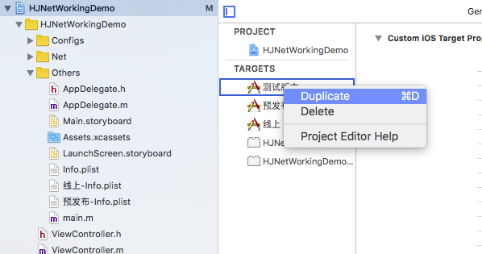
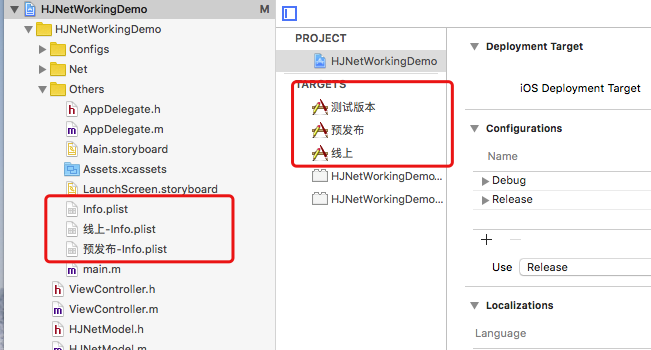
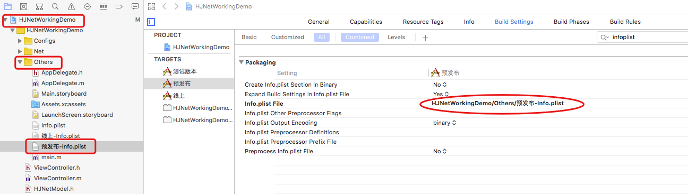
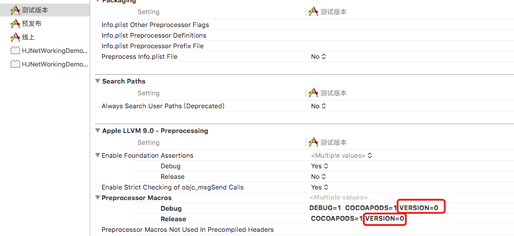
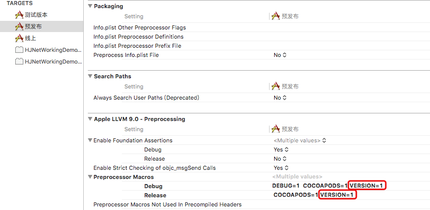
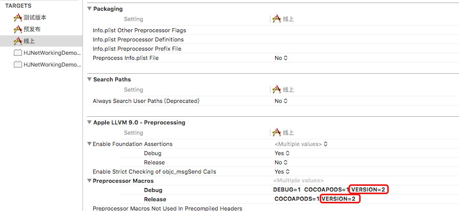
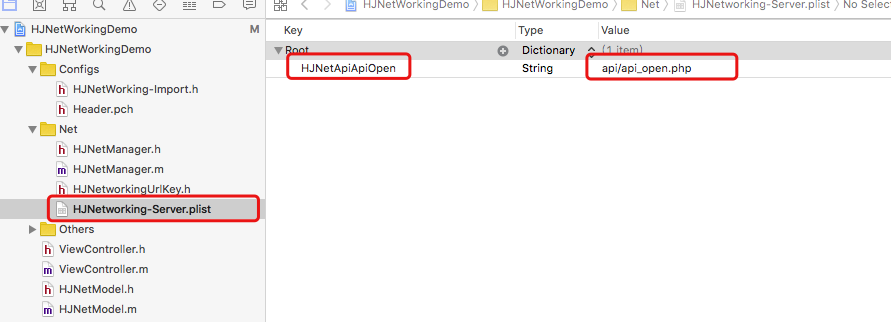
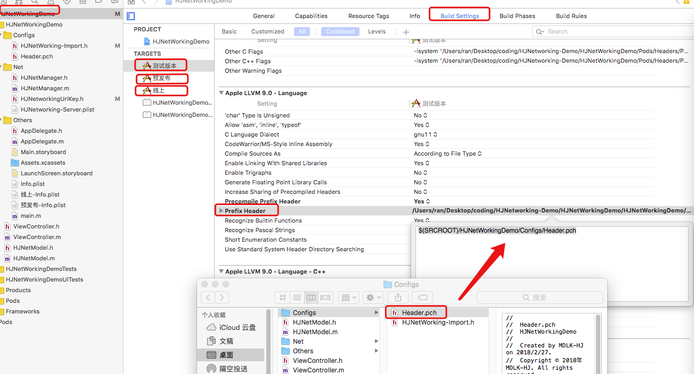

### 版本控制

1、添加Target

在TARGETS中右击"测试版本"选择"Duplicate"，会copy一份Target并且会新增一个info.plisy文件，双击名称可对名称进行修改，让Target的名称与info.plist的名称对应以增加可读性，如图所示：





2、修改info.plist File的路径

在修改了info.plist名称之后，对应的Target是找不到Info的，原因在于对应Target下的Build Settings 中 info.plist File路径不正确，所以进行路劲的修改，如图所示：



3、添加预处理宏以进行版本控制

选择对应的Target，选择上方的Build Settings，预处理器宏(Preprocessor Macros)，在Debug与Release下添加宏，VERSION的值分别为0，1，2，如图所示：

测试版本


预发布


发布


4、创建Header File文件

在前面已经构建了3个Target，并对不同的Target添加了相同的预处理器宏同时指定了不同的值来区分，在开发过程中，后台会根据不同的环境提供不同的api接口，前端在做网络请求时也会根据不同的环境切换BaseUrl，于是创建一个名为"HJNetworkingUrlKey"的头文件，针对不同的环境提供相同的宏，不同的api接口（代码中api都是相同的，实际开发中在不同环境下填写对应的api即可）

```
#ifndef HJNetworkingUrlKey_h
#define HJNetworkingUrlKey_h

// 测试
#if VERSION == 0

#define HJBaseUrl @"http://api.budejie.com/"

// 预发布
#elif VERSION == 1

#define HJBaseUrl @"http://api.budejie.com/"

// 发布
#elif VERSION == 2

#define HJBaseUrl @"http://api.budejie.com/"

#endif


#endif /* HJNetworkingUrlKey_h */
```

5、创建plist文件

针对后台提供的接口文档，将不同环境下的BaseUrl利用宏来进行了替代，所提供的文件名为了方便管理，使用plist文件加上静态全局变量即可，创建名为 "HJNetworking-Server"的plist文件，将后台提供的文件名设为value，输入对应的键，如图:



回到"HJNetworkingUrlKey"文件中，设置对应的静态全局变量，变量的值为"HJNetworking-Server"plist文件对应文件名接口的键(做好网络二次封装之后做测试)

```
/...../

#endif /* HJNetworkingUrlKey_h */

// urlKey格式
// static NSString * HJGoodBoy = @"goodBoy";

static NSString *HJNetApiApiOpen = @"HJNetApiApiOpen";

```
到这里，可能第4、5两点看不出来有任何的作用，继续往下面，当进行网络请求的二次封装以及调用接口进行网络请求时，回来理解4、5两点，便明白其中的用意

### AFNetworking的二次封装

AFNetworking的导入网上有很多的资料，这里就不再提及，直接进行二次封装，在封装之前为了让项目更接近实际开发，也为了让代码的可读性更高、更优雅，先创建一个名为"HJNetWorking-Import"的Header File文件用于导入框架于类，再创建一个名为"Header"的pch文件。
在"HJNetWorking-Import"头文件中导入需要的框架和类，在"Header"pch文件中导入"HJNetWorking-Import"头文件，代码如下：

```
#ifndef HJNetWorking_Import_h
#define HJNetWorking_Import_h

#pragma mark - 三方框架
#import <AFNetworking.h>

#pragma mark - 框架
#import <AVFoundation/AVFoundation.h>

#pragma mark - 网络
#import "HJNetManager.h"
#import "HJNetworkingUrlKey.h"

#endif /* HJNetWorking_Import_h */
```

```
#ifndef Header_pch
#define Header_pch

#import "HJNetWorking-Import.h"

#endif /* Header_pch */
```

导入的"HJNetManager"类是用来做网络请求的，导入AVFoundation框架是因为在"HJNetManager"中做了视频上传功能，"HJNetworkingUrlKey"类是用于存放api接口。

pch文件创建之后，需要在对应的Target分类中去设置 Prefix Header的路径，右击"Header.pch" -> Show in Finder，就是Header.pch的路径，再点击各个环境的Target，选择Build Settings 搜索到Prefix Header，将Finder中的pch文件拖到方框中，并将前面的路径改为$(SRCROOT)，如图所示：



1、HJNetManager.h代码理解

在顶部定义了一个宏"HJNetLogInfo"，更方便查看控制台的日志，接下来定义了四个Block，用于成功、失败、完成、进度的回调，"sharedNetManager"类方法用于创建单利，GET 针对不同的请求提供了三种方式，POST 针对不同的请求也提供了三种方式，上传图片，上传视频，下载文件以及取消指定请求和取消全部请求都在.h文件中暴露了接口

```
#define HJNetLogInfo  [NSString stringWithFormat:@"Class:%@,Line:%d",NSStringFromClass([self class]),__LINE__]

#import <Foundation/Foundation.h>

/**
 成功回调

 @param response 返回的json数据
 @param decode 是否进行解密
 */
typedef void(^successBlock)(id response, BOOL decode);

/**
 失败回调

 @param error error信息
 */
typedef void(^errorBlock)(NSError *error);

/**
 完成回调

 @param response 返回的数据
 */
typedef void(^completeBlock)(id response);

/**
 进度
 
 @param progressValue 进度（0~1）
 */
typedef void(^progressBlock)(float progressValue);

@interface HJNetManager : NSObject


/**
 创建单利

 @return return value description
 */
+ (instancetype)sharedNetManager;


/**
 GET 丨请求

 @param url             请求地址
 @param params          参数
 @param logInfo         打印回调信息，便于查找方法请求地址,直接传:MCNetLogInfo
 @param successCallback 成功回调
 @param errorCallback   失败回调
 @return                返回类型
 */
- (NSURLSessionDataTask *)getStringWithUrl:(NSString *)url
                            withParameters:(NSString *)params
                               withLogInfo:(NSString *)logInfo
                               withSuccess:(successBlock)successCallback
                                 withError:(errorBlock)errorCallback;

/**
 GET Json 请求

 @param url             请求地址
 @param params          参数
 @param logInfo         打印回调信息，便于查找方法请求地址,直接传:MCNetLogInfo
 @param successCallback 成功回调
 @param errorCallback   失败回调
 @return                返回类型
 */
- (NSURLSessionDataTask *)getJsonWithUrl:(NSString *)url
                          withParameters:(NSDictionary *)params
                             withLogInfo:(NSString *)logInfo
                             withSuccess:(successBlock)successCallback
                               withError:(errorBlock)errorCallback;

/**
 GET 不加密的请求

 @param url             请求地址
 @param params          参数
 @param logInfo         打印回调信息，便于查找方法请求地址,直接传:MCNetLogInfo
 @param successCallback 成功回调
 @param errorCallback   失败回调
 @return                返回类型
 */
- (NSURLSessionDataTask *)getNoEncryptionWithUrl:(NSString *)url
                                  withParameters:(id)params
                                     withLogInfo:(NSString *)logInfo
                                     withSuccess:(successBlock)successCallback
                                       withError:(errorBlock)errorCallback;

/**
 POST 丨 请求
 
 @param url             请求地址
 @param params          参数
 @param logInfo         打印回调信息，便于查找方法请求地址,直接传:MCNetLogInfo
 @param successCallback 成功回调
 @param errorCallback   失败回调
 @return                返回类型
 */
- (NSURLSessionDataTask *)postStringWithUrl:(NSString *)url
                             withParameters:(NSString *)params
                                withLogInfo:(NSString *)logInfo
                                withSuccess:(successBlock)successCallback
                                  withError:(errorBlock)errorCallback;

/**
 POST Json 请求
 
 @param url             请求地址
 @param params          参数
 @param logInfo         打印回调信息，便于查找方法请求地址,直接传:MCNetLogInfo
 @param successCallback 成功回调
 @param errorCallback   失败回调
 @return                返回类型
 */
- (NSURLSessionDataTask *)postJsonWithUrl:(NSString *)url
                           withParameters:(NSDictionary *)params
                              withLogInfo:(NSString *)logInfo
                              withSuccess:(successBlock)successCallback
                                withError:(errorBlock)errorCallback;

/**
 POST 不加密请求

 @param url             请求地址
 @param params          参数
 @param logInfo         打印回调信息，便于查找方法请求地址,直接传:MCNetLogInfo
 @param successCallback 成功回调
 @param errorCallback   失败回调
 @return                返回类型
 */
- (NSURLSessionDataTask *)postNoEncryptionWithUrl:(NSString *)url
                                   withParameters:(id)params
                                      withLogInfo:(NSString *)logInfo
                                      withSuccess:(successBlock)successCallback
                                        withError:(errorBlock)errorCallback;


/**
 上传图片

 @param images           需要上传的图片
 @param params           参数
 @param logInfo         打印回调信息，便于查找方法请求地址,直接传:MCNetLogInfo
 @param urlString        上传的url
 @param progressCallback 上传进度回调
 @param successCallback  成功回调
 @param errorCallback    失败回调
 @return                 返回类型
 */
- (NSURLSessionDataTask *)uploadImageWithImages:(NSArray<UIImage *> *)images
                                        withUrl:(NSString *)urlString
                                 withParameters:(id)params
                                    withLogInfo:(NSString *)logInfo
                                   withProgress:(progressBlock)progressCallback
                                    withSuccess:(successBlock)successCallback
                                      withError:(errorBlock)errorCallback;


/**
 上传视频

 @param videoPath        视频沙盒路径
 @param urlString        上传的url
 @param params           参数
 @param logInfo         打印回调信息，便于查找方法请求地址,直接传:MCNetLogInfo
 @param progressCallback 上传进度回调
 @param successCallback  成功回调
 @param errorCallback    失败回调
 @return                 返回类型
 */
- (NSURLSessionDataTask *)uploadVideoWithVideoPath:(NSString *)videoPath
                                           withUrl:(NSString *)urlString
                                    withParameters:(id)params
                                       withLogInfo:(NSString *)logInfo
                                      withProgress:(progressBlock)progressCallback
                                       withSuccess:(successBlock)successCallback
                                         withError:(errorBlock)errorCallback;

/**
 下载文件

 @param path             保存路径
 @param urlString        下载的url
 @param params           参数
 @param logInfo         打印回调信息，便于查找方法请求地址,直接传:MCNetLogInfo
 @param progressCallback 下载进度回调
 @param successCallback  成功回调
 @param errorCallback    失败回调
 @return                 返回类型
 */
- (NSURLSessionDownloadTask *)downloadFileWithSavePath:(NSString *)path
                                               withUrl:(NSString *)urlString
                                        withParameters:(id)params
                                           withLogInfo:(NSString *)logInfo
                                          withProgress:(progressBlock)progressCallback
                                           withSuccess:(successBlock)successCallback
                                             withError:(errorBlock)errorCallback;


/**
 取消指定的url请求（url为空代表取消所有同类型的url请求）

 @param type      请求类型 `GET`, `POST`, `PUT`, or `DELETE`,不能为空
 @param urlString 需要取消的url
 */
- (void)cancelHttpRequestWithRequestType:(NSString *)type
                                 withUrl:(NSString *)urlString
                          withParameters:(id)params;


/**
 取消所有的url请求
 */
- (void)cancelAllRequest;
@end
```

2、HJNetManager.m代码理解

首先提供四个属性：

manager：用于做网络请求
urlManager：用于做会话配置
networkManager：用于做网络监管
urlDict：在Target做版本控制第5步中，创建了一个plist文件来做文件名(接口)的存储，此处的字典就是通过指定的键去获取指定的值(接口)

```
#import "HJNetManager.h"

@interface HJNetManager()

/**
 请求者
 */
@property (nonatomic, strong) AFHTTPSessionManager *manager;

/**
 url
 */
@property (nonatomic, strong) AFURLSessionManager *urlManager;


/**
 网络监管
 */
@property (nonatomic, strong) AFNetworkReachabilityManager *networkManager;

/**
 装url的字典
 */
@property (nonatomic, strong) NSDictionary *urlDict;

@end
```

其次在下方代码中，具体的实现的单利方法，重写了init方法，提供了一个对象方法以获取证书，最后通过懒加载去获取了"HJNetworking-Server.plist"文件的数据。在重写的init方法中 "HJBaseUrl"是针对不同的环境配置的接口BaseURL，内容类型设置包含text/html和text/plain，text/html意思是在获取到这种文件时会自动调用html的解析器对文件进行相应的处理；text/plain的意思是将文件设置为纯文本的形式，浏览器在获取到这种文件时并不会对其进行处理。

```
@implementation HJNetManager

static HJNetManager *netManager;
#pragma mark - 单利
+ (instancetype)sharedNetManager {
    static dispatch_once_t onceToken;
    dispatch_once(&onceToken, ^{
        netManager = [[HJNetManager alloc] init];
    });
    return netManager;
}

+ (instancetype)allocWithZone:(struct _NSZone *)zone {
    static dispatch_once_t onceToken;
    dispatch_once(&onceToken, ^{
        netManager = [super allocWithZone:zone];
    });
    return netManager;
}
- (id)copyWithZone:(NSZone *)zone {
    return netManager;
}

#pragma mark - 重写init方法
- (instancetype)init {
    if (self = [super init]) {
        self.manager = [[AFHTTPSessionManager alloc] initWithBaseURL:[NSURL URLWithString:HJBaseUrl]];
        self.manager.responseSerializer.acceptableContentTypes = [self.manager.responseSerializer.acceptableContentTypes setByAddingObjectsFromArray:@[@"text/html", @"text/plain"]];
#if VERSION == 2
        self.manager.securityPolicy = [self getSecurity];
#else
        self.urlManager = [[AFURLSessionManager alloc] initWithSessionConfiguration:[NSURLSessionConfiguration defaultSessionConfiguration]];
#endif
        self.networkManager = [AFNetworkReachabilityManager sharedManager];
        [self.networkManager startMonitoring];
        [self.networkManager setReachabilityStatusChangeBlock:^(AFNetworkReachabilityStatus status) {
            if (status == AFNetworkReachabilityStatusUnknown) {
                // 未知
                NSLog(@"未知连接");
            } else if (status == AFNetworkReachabilityStatusNotReachable) {
                // 未连接
                NSLog(@"未连接");
            } else if (status == AFNetworkReachabilityStatusReachableViaWWAN) {
                // 网络
                NSLog(@"网络连接");
            } else if (status == AFNetworkReachabilityStatusReachableViaWiFi) {
                // Wifi
                NSLog(@"Wifi连接");
            }
        }];
    }
    return self;
}

#pragma mark - 证书的获取
- (AFSecurityPolicy *)getSecurity {
    NSLog(@"获取证书");
    //证书的路径
    NSString *path = [[NSBundle mainBundle] pathForResource:@"safer" ofType:@"cer"];
    NSData *data = [NSData dataWithContentsOfFile:path];
    NSSet *certificates = [NSSet setWithObject:data];
 AFSecurityPolicy *policy = [AFSecurityPolicy policyWithPinningMode:AFSSLPinningModeCertificate withPinnedCertificates:certificates];
    //是否允许过期证书
    policy.allowInvalidCertificates = NO;
    //是否验证域名
    policy.validatesDomainName = YES;
    return policy;
}

// ....中间代码暂时忽略....//

#pragma mark - get & set

- (NSDictionary *)urlDict {
    if (!_urlDict) {
        NSString *filePath = [[NSBundle mainBundle] pathForResource:@"HJNetworking-Server" ofType:@"plist"];
        _urlDict = [NSDictionary dictionaryWithContentsOfFile:filePath];
    }
    return _urlDict;
}


@end
```

针对外部调用的"GET | 请求"，"GET JSON 请求"， "POST | 请求"，"POST JSON 请求" 提供了两个对象方法，在去实现上述4个方法做网络请求并不会调用AFHTTPSessionManager对应的对象方法，而是调用下方对应的GET、POST方法，其目的是为了做代码的封装，不用些过多的重复代码。在下方代码中主要做了网络得部分处理，传入url的处理，url带有http表明是一个完整的请求接口，否则需要通过传入的url(静态全局变量，在Target版本控制的"HJNetworkingUrlKey"头文件中，实现过对应接口的键的静态全局变量)，在字典中去查找对应的api接口

```

// ....上方代码忽略....//
#pragma mark - 统一的GET & POST 请求


/**
 内部 GET 请求

 @param url              请求地址
 @param params           参数
 @param completeCallBack 成功回调
 @param errorCallback    失败回调
 @return                 返回类型
 */
- (NSURLSessionDataTask *)get:(NSString *)url
                        param:(NSString *)params
                      success:(completeBlock)completeCallBack
                        error:(errorBlock)errorCallback {
    if (self.networkManager.networkReachabilityStatus == AFNetworkReachabilityStatusNotReachable) {
        NSError *error = [[NSError alloc] initWithDomain:@"errorinfo"
                                                    code:404
                                                userInfo:@{@"errorinfo":@"网络连接中断"}];
        if (errorCallback) {
            errorCallback(error);
        }
        return nil;
    }
    NSString *requestUrl = nil;
    if ([url containsString:@"http"]) {
        requestUrl = url;
    } else {
        requestUrl = [self.urlDict valueForKey:url];
    }
    NSURLSessionDataTask *dataTask = [self.manager GET:requestUrl parameters:params progress:nil success:^(NSURLSessionDataTask * _Nonnull task, id  _Nullable responseObject) {
        if (completeCallBack) {
            completeCallBack(responseObject);
        }
    } failure:^(NSURLSessionDataTask * _Nullable task, NSError * _Nonnull error) {
        if (errorCallback) {
            errorCallback(error);
        }
    }];
    return dataTask;
}


/**
 内部 POST 请求

 @param url              请求地址
 @param params           参数
 @param completeCallBack 成功回调
 @param errorCallBack    失败回调
 @return                 返回类型
 */
- (NSURLSessionDataTask *)post:(NSString *)url
                         param:(NSString *)params
                       success:(completeBlock)completeCallBack
                         error:(errorBlock)errorCallBack {
    if (self.networkManager.networkReachabilityStatus == AFNetworkReachabilityStatusNotReachable) {
        NSError *error = [[NSError alloc] initWithDomain:@"errorinfo"
                                                    code:404
                                                userInfo:@{@"errorinfo":@"网络连接中断"}];
        if (errorCallBack) {
            errorCallBack(error);
        }
        return nil;
    }
    NSString *requestUrl = nil;
    if ([url containsString:@"http"]) {
        requestUrl = requestUrl;
    } else {
        requestUrl = [self.urlDict valueForKey:url];
    }
    NSURLSessionDataTask *dataTask = [self.manager POST:requestUrl parameters:params progress:nil success:^(NSURLSessionDataTask * _Nonnull task, id  _Nullable responseObject) {
        if (completeCallBack) {
            completeCallBack(responseObject);
        }
    } failure:^(NSURLSessionDataTask * _Nullable task, NSError * _Nonnull error) {
        if (errorCallBack) {
            errorCallBack(error);
        }
    }];
    return dataTask;
}

// ....下放代码忽略....//
```

完成网路请求之后统一的进行成功与失败的处理，也是对代码的一种封装，在统一处理中就需要根据后台返回的数据去进行具体的处理，数据可能加密，可能没加密，加密了解密的方法也不一定都相同，此处接口所获取到的数据并不需要解密。"kLog"是定义的宏，区分在debug与release模式下如何处理日志(未定义kLog宏可以用NSLog代替，不过未处理debug与release模式下日志的打印)

```
// ....上放代码忽略....//

#pragma mark - 请求成功统一处理

/**
 请求成功的统一处理

 @param response        请求结果数据
 @param logInfo         打印回调信息，便于查找方法请求地址,直接传:MCNetLogInfo
 @param successCallback 成功回调
 @param errorCallback   错误回调
 */
- (void)successHandleWithResponse:(id)response
                      withLogInfo:(NSString *)logInfo
                      withSuccess:(successBlock)successCallback
                        withError:(errorBlock)errorCallback {
    // ...... 跟具后端返回的json进行解析......
    // ...... 如果做了加密处理，此处需根据密钥进行解密操作......
    if (response) {
        if (successCallback) {
            successCallback(response, NO);
        }
        kLog(@"请求数据：%@:%@",logInfo,response);
    } else {
        //错误信息处理
        NSError *error = [NSError errorWithDomain:@""
                                             code:123
                                         userInfo:@{}];
        [self errorHandleWithError:error withLogInfo:logInfo withError:errorCallback];
    }
    
}

#pragma mark - 请求失败统一处理

/**
 请求失败的统一处理

 @param error         错误描述
 @param logInfo       打印回调信息，便于查找方法请求地址,直接传:MCNetLogInfo
 @param errorCallback 失败的回调
 */
- (void)errorHandleWithError:(NSError *)error
                 withLogInfo:(NSString *)logInfo
                   withError:(errorBlock)errorCallback {
    // 是否需要针对某些特定的code尽心处理，不需要则直接传出错误信息
    if (error.code == 123) {
        //此处code == 123 做举例，实际开发中针对需要进行特殊处理的code进行判断处理
        //比如说此处我们针对code123进行某种提示，并取消先前的请求
        [[self class] cancelPreviousPerformRequestsWithTarget:self selector:@selector(showAlert) object:nil];
        [self performSelector:@selector(showAlert) withObject:nil afterDelay:1.5];
    } else {
        if (errorCallback) {
            errorCallback(error);
        }
    }
    kLog(@"错误信息：%@-%@",logInfo,error);
}

- (void)showAlert {
    //message换做实际开发中提示信息
    UIAlertController *alertC = [UIAlertController alertControllerWithTitle:@"" message:@"这是在做测试" preferredStyle:UIAlertControllerStyleAlert];
    UIAlertAction *sureA = [UIAlertAction actionWithTitle:@"" style:UIAlertActionStyleDefault handler:nil];
    [alertC addAction:sureA];
    [[UIApplication sharedApplication].keyWindow.rootViewController presentViewController:alertC animated:YES completion:nil];
}

// ....下放代码忽略....//
```

在此段代码中实现了 GET 不同形式的请求与 POST 的不同形式的请求，实现了简单的base64编码，防止数据明文传输，加密的方式有很多，比如说MD5,DES,AES,RSA,HTTPS等等，根据与后台的约定来进行加密方式的选择。

```
// ....上方代码忽略....  //

#pragma mark - 外部调用请求

#pragma mark GET
/**
 GET 丨请求
 
 @param url             请求地址
 @param params          参数
 @param logInfo         打印回调信息，便于查找方法请求地址,直接传:MCNetLogInfo
 @param successCallback 成功回调
 @param errorCallback   失败回调
 @return                返回类型
 */
- (NSURLSessionDataTask *)getStringWithUrl:(NSString *)url
                            withParameters:(NSString *)params
                               withLogInfo:(NSString *)logInfo
                               withSuccess:(successBlock)successCallback
                                 withError:(errorBlock)errorCallback {
    NSData *data = [params dataUsingEncoding:NSUTF8StringEncoding];
    // 加密处理
    // ......
    NSString *paramsStr = [data base64EncodedStringWithOptions:0];
    NSURLSessionDataTask *dataTask = [self get:url param:paramsStr success:^(id response) {
        [self successHandleWithResponse:response withLogInfo:logInfo withSuccess:successCallback withError:errorCallback];
    } error:^(NSError *error) {
        [self errorHandleWithError:error withLogInfo:logInfo withError:errorCallback];
    }];
    return dataTask;
}

/**
 GET Json 请求
 
 @param url             请求地址
 @param params          参数
 @param logInfo         打印回调信息，便于查找方法请求地址,直接传:MCNetLogInfo
 @param successCallback 成功回调
 @param errorCallback   失败回调
 @return                返回类型
 */
- (NSURLSessionDataTask *)getJsonWithUrl:(NSString *)url
                          withParameters:(NSDictionary *)params
                             withLogInfo:(NSString *)logInfo
                             withSuccess:(successBlock)successCallback
                               withError:(errorBlock)errorCallback {
    NSError *error;
    if (!params) {
        params = @{};
    }
    NSData *data = [NSJSONSerialization dataWithJSONObject:params options:NSJSONWritingPrettyPrinted error:&error];
    // 加密处理
    // ......
    NSString *paramsStr = [data base64EncodedStringWithOptions:0];
    NSURLSessionDataTask *dataTask = [self get:url param:paramsStr success:^(id response) {
        [self successHandleWithResponse:response withLogInfo:logInfo withSuccess:successCallback withError:errorCallback];
    } error:^(NSError *error) {
        [self errorHandleWithError:error withLogInfo:logInfo withError:errorCallback];
    }];
    return dataTask;
}

/**
 GET 不加密的请求
 
 @param url             请求地址
 @param params          参数
 @param logInfo         打印回调信息，便于查找方法请求地址,直接传:MCNetLogInfo
 @param successCallback 成功回调
 @param errorCallback   失败回调
 @return                返回类型
 */
- (NSURLSessionDataTask *)getNoEncryptionWithUrl:(NSString *)url
                                  withParameters:(id)params
                                     withLogInfo:(NSString *)logInfo
                                     withSuccess:(successBlock)successCallback
                                       withError:(errorBlock)errorCallback {
    NSString *requestUrl = nil;
    if ([url containsString:@"http"]) {
        requestUrl = requestUrl;
    } else {
        requestUrl = [self.urlDict valueForKey:url];
    }
    if (!params) {
        params = @{};
    }
    
    NSURLSessionDataTask *dataTask = [self.manager GET:requestUrl
                                            parameters:params
                                              progress:nil success:^(NSURLSessionDataTask * _Nonnull task, id  _Nullable responseObject) {
                                                  [self successHandleWithResponse:responseObject
                                                                      withLogInfo:logInfo
                                                                      withSuccess:successCallback
                                                                        withError:errorCallback];
                                              } failure:^(NSURLSessionDataTask * _Nullable task, NSError * _Nonnull error) {
                                                  [self errorHandleWithError:error
                                                                 withLogInfo:logInfo
                                                                   withError:errorCallback];
                                              }];
    return dataTask;
}

#pragma mark POST

/**
 POST 丨 请求
 
 @param url             请求地址
 @param params          参数
 @param logInfo         打印回调信息，便于查找方法请求地址,直接传:MCNetLogInfo
 @param successCallback 成功回调
 @param errorCallback   失败回调
 @return                返回类型
 */
- (NSURLSessionDataTask *)postStringWithUrl:(NSString *)url
                             withParameters:(NSString *)params
                                withLogInfo:(NSString *)logInfo
                                withSuccess:(successBlock)successCallback
                                  withError:(errorBlock)errorCallback {
    NSData *data = [params dataUsingEncoding:NSUTF8StringEncoding];
    // 加密处理，选择何种加密算法
    // ......
    NSString *paramsStr = [data base64EncodedStringWithOptions:0];
    NSURLSessionDataTask *dataTask = [self post:url param:paramsStr success:^(id response) {
        [self successHandleWithResponse:response withLogInfo:logInfo withSuccess:successCallback withError:errorCallback];
    } error:^(NSError *error) {
        [self errorHandleWithError:error withLogInfo:logInfo withError:errorCallback];
    }];
    return dataTask;
}

/**
 POST Json 请求
 
 @param url             请求地址
 @param params          参数
 @param logInfo         打印回调信息，便于查找方法请求地址,直接传:MCNetLogInfo
 @param successCallback 成功回调
 @param errorCallback   失败回调
 @return                返回类型
 */
- (NSURLSessionDataTask *)postJsonWithUrl:(NSString *)url
                           withParameters:(NSDictionary *)params
                              withLogInfo:(NSString *)logInfo
                              withSuccess:(successBlock)successCallback
                                withError:(errorBlock)errorCallback {
    NSError *error;
    if (!params) {
        params = @{};
    }
    NSData *data = [NSJSONSerialization dataWithJSONObject:params options:NSJSONWritingPrettyPrinted error:&error];
    // 加密处理，选择何种加密算法
    // ......
    // 0 代表不插入字符
    NSString *paramsStr = [data base64EncodedStringWithOptions:0];
    NSURLSessionDataTask *dataTask = [self post:url param:paramsStr success:^(id response) {
        [self successHandleWithResponse:response withLogInfo:logInfo withSuccess:successCallback withError:errorCallback];
    } error:^(NSError *error) {
        [self errorHandleWithError:error withLogInfo:logInfo withError:errorCallback];
    }];
    return dataTask;
}

/**
 POST 不加密请求
 
 @param url             请求地址
 @param params          参数
 @param logInfo         打印回调信息，便于查找方法请求地址,直接传:MCNetLogInfo
 @param successCallback 成功回调
 @param errorCallback   失败回调
 @return                返回类型
 */
- (NSURLSessionDataTask *)postNoEncryptionWithUrl:(NSString *)url
                                   withParameters:(id)params
                                      withLogInfo:(NSString *)logInfo
                                      withSuccess:(successBlock)successCallback
                                        withError:(errorBlock)errorCallback {
    NSString *requestUrl = nil;
    if ([url containsString:@"http"]) {
        requestUrl = requestUrl;
    } else {
        requestUrl = [self.urlDict valueForKey:url];
    }
    if (!params) {
        params = @{};
    }
    NSURLSessionDataTask *dataTask = [self.manager POST:requestUrl
                                             parameters:params progress:nil success:^(NSURLSessionDataTask * _Nonnull task, id  _Nullable responseObject) {
                                                 [self successHandleWithResponse:responseObject withLogInfo:logInfo withSuccess:successCallback withError:errorCallback];
                                             } failure:^(NSURLSessionDataTask * _Nullable task, NSError * _Nonnull error) {
                                                 [self errorHandleWithError:error withLogInfo:logInfo withError:errorCallback];
                                             }];
    return dataTask;
}
// ....下方代码忽略....  //
```

上传图片需要注意对图片的压缩，方法有很多种，此处使用UIImageJPEGRepresentation进行简单的处理

```
#pragma mark - 图片的上传

/**
 上传图片
 
 @param images           需要上传的图片
 @param params           参数
 @param urlString        上传的url
 @param logInfo          打印回调信息，便于查找方法请求地址,直接传:MCNetLogInfo
 @param progressCallback 上传进度回调
 @param successCallback  成功回调
 @param errorCallback    失败回调
 @return                 返回类型
 */
- (NSURLSessionDataTask *)uploadImageWithImages:(NSArray<UIImage *> *)images
                                        withUrl:(NSString *)urlString
                                 withParameters:(id)params
                                    withLogInfo:(NSString *)logInfo
                                   withProgress:(progressBlock)progressCallback
                                    withSuccess:(successBlock)successCallback
                                      withError:(errorBlock)errorCallback {
    if (images.count == 0 || images == nil || images == NULL) return nil;
    NSString *requestString = nil;
    if ([urlString containsString:@"http"]) {
        requestString = urlString;
    } else {
        requestString = [self.urlDict valueForKey:urlString];
    }
    if(!params) {
        params = @{};
    }
    NSURLSessionDataTask *dataTask = [self.manager POST:requestString parameters:params constructingBodyWithBlock:^(id<AFMultipartFormData>  _Nonnull formData) {
        for (int i = 0 ; i < images.count; i++) {
            if ([images[i] isKindOfClass:[UIImage class]]) {
                // 对图片进行压缩
                // ......
                NSData *imageData = UIImageJPEGRepresentation(images[i], 0.5);
                [formData appendPartWithFileData:imageData name:@"file" fileName:[NSString stringWithFormat:@"test%d.jpg", i] mimeType:@"image/jpeg"];
            }
        }
    } progress:^(NSProgress * _Nonnull uploadProgress) {
        if (progressCallback) {
            progressCallback(uploadProgress.completedUnitCount / uploadProgress.totalUnitCount);
        }
    } success:^(NSURLSessionDataTask * _Nonnull task, id  _Nullable responseObject) {
        [self successHandleWithResponse:responseObject withLogInfo:logInfo withSuccess:successCallback withError:errorCallback];
    } failure:^(NSURLSessionDataTask * _Nullable task, NSError * _Nonnull error) {
        [self errorHandleWithError:error withLogInfo:logInfo withError:errorCallback];
    }];
    return dataTask;
}
```
在做视频上传有几个重要的点，第一是视频的路径，需要获取到视频所保存的沙盒路径；第二使用AVAssetExportSession异步方法exportAsynchronouslyWithCompletionHandler；第三调用AFNetworking的对应方法

```
#pragma mark - 视频的上传

/**
 上传视频
 
 @param videoPath        视频沙盒路径
 @param urlString        上传的url
 @param params           参数
 @param logInfo          打印回调信息，便于查找方法请求地址,直接传:MCNetLogInfo
 @param progressCallback 上传进度回调
 @param successCallback  成功回调
 @param errorCallback    失败回调
 @return                 返回类型
 */
- (NSURLSessionDataTask *)uploadVideoWithVideoPath:(NSString *)videoPath
                                           withUrl:(NSString *)urlString
                                    withParameters:(id)params
                                       withLogInfo:(NSString *)logInfo
                                      withProgress:(progressBlock)progressCallback
                                       withSuccess:(successBlock)successCallback
                                         withError:(errorBlock)errorCallback {
    if ([videoPath isEqualToString:@""] || videoPath == nil || videoPath == NULL) return nil;
    NSString *requestString = nil;
    if ([urlString containsString:@"http"]) {
        requestString = urlString;
    } else {
        requestString = [self.urlDict valueForKey:urlString];
    }
    if(!params) {
        params = @{};
    }
    // 视频的asset
    AVAsset *asset = [AVAsset assetWithURL:[NSURL URLWithString:videoPath]];
    // 压缩
    // AVAssetExportPresetLowQuality        低质量 可以通过移动网络分享
    // AVAssetExportPresetMediumQuality     中等质量 可以通过WIFI网络分享
    // AVAssetExportPresetHighestQuality    高等质量
    // AVAssetExportPreset640x480
    // AVAssetExportPreset960x540
    // AVAssetExportPreset1280x720    720pHD
    // AVAssetExportPreset1920x1080   1080pHD
    // AVAssetExportPreset3840x2160
    AVAssetExportSession *export = [AVAssetExportSession exportSessionWithAsset:asset presetName:AVAssetExportPreset960x540];
    // 日期时间格式化
    NSDateFormatter *dataF = [[NSDateFormatter alloc] init];
    dataF.dateFormat = @"yyyy-MM-dd,HH:mm:ss";
    NSString *dateStr = [dataF stringFromDate:[NSDate date]];
    // 视频写入的路径
    NSString *videoWritePath = [NSSearchPathForDirectoriesInDomains(NSCachesDirectory, NSUserDomainMask, YES).firstObject stringByAppendingString:[NSString stringWithFormat:@"/output-%@.mp4",dateStr]];
    // 转换后的视频地址
    export.outputURL = [NSURL URLWithString:videoWritePath];
    export.outputFileType = AVFileTypeMPEG4;
    __block NSURLSessionDataTask *dataTask = nil;
    [export exportAsynchronouslyWithCompletionHandler:^{
        if (export.status == AVAssetExportSessionStatusCompleted) {
           dataTask = [self.manager POST:requestString parameters:params constructingBodyWithBlock:^(id<AFMultipartFormData>  _Nonnull formData) {
                
            } progress:^(NSProgress * _Nonnull uploadProgress) {
                if (progressCallback) {
                    progressCallback(uploadProgress.completedUnitCount / uploadProgress.totalUnitCount);
                }
            } success:^(NSURLSessionDataTask * _Nonnull task, id  _Nullable responseObject) {
                [self successHandleWithResponse:responseObject withLogInfo:logInfo withSuccess:successCallback withError:errorCallback];
            } failure:^(NSURLSessionDataTask * _Nullable task, NSError * _Nonnull error) {
                [self errorHandleWithError:error withLogInfo:logInfo withError:errorCallback];
            }];
        }else {
            NSLog(@"未完成");
        }
    }];
    return dataTask;
}
```
文件的下载此处做了简单的实现

```
#pragma mark - 下载文件

/**
 下载文件
 
 @param path             保存路径
 @param urlString        下载的url
 @param params           参数
 @param logInfo          打印回调信息，便于查找方法请求地址,直接传:MCNetLogInfo
 @param progressCallback 下载进度回调
 @param successCallback  成功回调
 @param errorCallback    失败回调
 @return                 返回类型
 */
- (NSURLSessionDownloadTask *)downloadFileWithSavePath:(NSString *)path
                                               withUrl:(NSString *)urlString
                                        withParameters:(id)params
                                           withLogInfo:(NSString *)logInfo
                                          withProgress:(progressBlock)progressCallback
                                           withSuccess:(successBlock)successCallback
                                             withError:(errorBlock)errorCallback {
    NSString *requestString = nil;
    if ([urlString containsString:@"http"]) {
        requestString = urlString;
    } else {
        requestString = [self.urlDict valueForKey:urlString];
    }
    if(!params) {
        params = @{};
    }
    NSURLSessionDownloadTask *downloadTask = [self.manager downloadTaskWithRequest:[NSURLRequest requestWithURL:[NSURL URLWithString:requestString]] progress:^(NSProgress * _Nonnull downloadProgress) {
        if (progressCallback) {
            progressCallback(downloadProgress.completedUnitCount / downloadProgress.totalUnitCount);
        }
    } destination:^NSURL * _Nonnull(NSURL * _Nonnull targetPath, NSURLResponse * _Nonnull response) {
        return [NSURL URLWithString:path];
    } completionHandler:^(NSURLResponse * _Nonnull response, NSURL * _Nullable filePath, NSError * _Nullable error) {
        if (error) {
            errorCallback(error);
        }else {
            if (successCallback) {
                [self successHandleWithResponse:response withLogInfo:logInfo withSuccess:successCallback withError:errorCallback];
            }
        }
    }];
    [downloadTask resume];
    return downloadTask;
}
```

二次封装的最后是取消请求，取消指定的请求一定需要传入请求的类型，取消请求也很简单，只需在manager.operationQueue.operations中获取到需要取消的请求，执行cancel操作就可以

```
#pragma mark - 取消url请求

/**
 取消指定的url请求（url为空代表取消所有同类型的url请求）
 
 @param type      请求类型 `GET`, `POST`, `PUT`, or `DELETE`,不能为空
 @param urlString 需要取消的url
 */
- (void)cancelHttpRequestWithRequestType:(NSString *)type withUrl:(NSString *)urlString withParameters:(id)params{
    if ([type isEqualToString:@""] || type == nil || type == NULL) {
        return;
    }
    NSError *error;
    NSString *cancelUrl = [[[self.manager.requestSerializer requestWithMethod:type URLString:urlString parameters:params error:&error] URL] path];
    // 获取队列中的请求
    for (NSOperation *operation in self.manager.operationQueue.operations) {
        // 如果是请求队列
        if ([operation isKindOfClass:[NSURLSessionTask class]]) {
            if ([cancelUrl isEqualToString:@""] || cancelUrl == nil || cancelUrl == NULL) {
                // 取消所有相同类型的请求
                // 请求的类型匹配
                if (type == [[(NSURLSessionTask *)operation currentRequest] HTTPMethod]) {
                    [operation cancel];
                }
            } else {
                // 请求类型匹配并且url也匹配
                if (type == [[(NSURLSessionTask *)operation currentRequest] HTTPMethod] &&
                    cancelUrl == [[[(NSURLSessionTask *)operation currentRequest] URL] path]) {
                    [operation cancel];
                }
            }
        }
    }
}


/**
 取消所有url请求
 */
- (void)cancelAllRequest {
    for (NSOperation *operation in [self.manager.operationQueue operations]) {
        if ([operation isKindOfClass:[NSURLSessionTask class]]) {
            [operation cancel];
        }
    }
}
```

### 网络请求测试

最后做一个网络请求的测试，创建"HJNetModel"继承NSObject，在.h中暴露加载数据的接口，在.m中进行实现，在项目的"ViewController"中创建一个按钮，调用数据请求的接口

暴露的接口

```
#import <Foundation/Foundation.h>

@interface HJNetModel : NSObject


/**
 加载数据

 @param type            类型
 @param successCallback 成功
 @param errorCallback   失败
 */
+ (void)loadDataWithType:(NSInteger)type
                 success:(successBlock)successCallback
                   error:(errorBlock)errorCallback;

@end
```

接口的实现

```
#import "HJNetModel.h"

@implementation HJNetModel


#pragma mark - 数据的加载
+ (void)loadDataWithType:(NSInteger)type
                 success:(successBlock)successCallback
                   error:(errorBlock)errorCallback {
    NSMutableDictionary *params = [NSMutableDictionary dictionary];
    params[@"a"] = @"list";
    params[@"c"] = @"data";
    params[@"type"] = @(type);
    [[HJNetManager sharedNetManager] getNoEncryptionWithUrl:HJNetApiApiOpen
                                             withParameters:params
                                                withLogInfo:HJNetLogInfo
                                                withSuccess:^(id response, BOOL decode) {
                                                    if (successCallback) {
                                                        successCallback(response, decode);
                                                    }
                                                } withError:^(NSError *error) {
                                                    if (errorCallback) {
                                                        errorCallback(error);
                                                    }
                                                }];
}

@end
```

ViewController.m中请求数据

```
#import "ViewController.h"
#import "HJNetModel.h"

@interface ViewController ()

@end

@implementation ViewController

- (void)viewDidLoad {
    [super viewDidLoad];
    self.view.backgroundColor = [UIColor orangeColor];
    UIButton *button = [[UIButton alloc] init];
    button.frame = CGRectMake(150, 150, 100, 50);
    button.layer.borderWidth = 1;
    button.layer.borderColor = [UIColor magentaColor].CGColor;
    button.titleLabel.font = [UIFont systemFontOfSize:20];
    [button setTitle:@"加载数据" forState:UIControlStateNormal];
    [button setTitleColor:[UIColor whiteColor] forState:UIControlStateNormal];
    [button addTarget:self action:@selector(loadData) forControlEvents:UIControlEventTouchUpInside];
    [self.view addSubview:button];
    UILabel *label = [[UILabel alloc] init];
    label.text = @"HJNetworkingDemo";
    label.textColor = [UIColor blackColor];
    label.font = [UIFont systemFontOfSize:24];
    label.frame = CGRectMake(100, 100, 300, 30);
    [self.view addSubview:label];
}


- (void)didReceiveMemoryWarning {
    [super didReceiveMemoryWarning];
    // Dispose of any resources that can be recreated.
}

- (void)loadData {
    [HJNetModel loadDataWithType:29 success:^(id response, BOOL decode) {
        
    } error:^(NSError *error) {
        
    }];
}

@end
```

> 运行项目，点击"加载数据"按钮，控制台打印出请求的数据，bingo ！！！