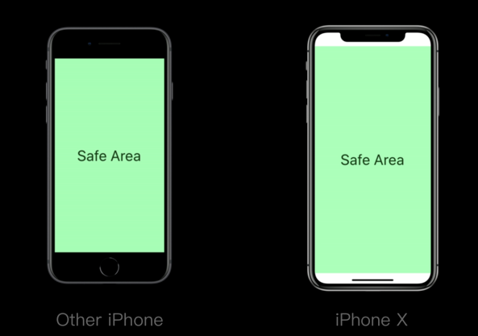
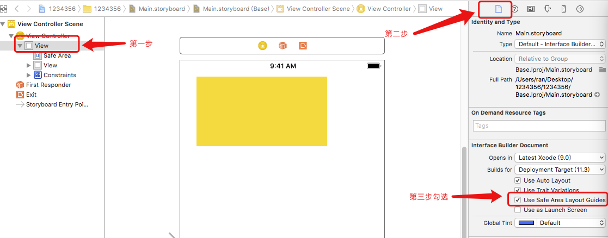
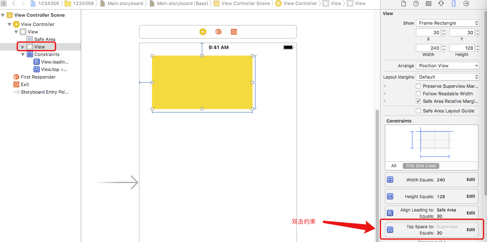
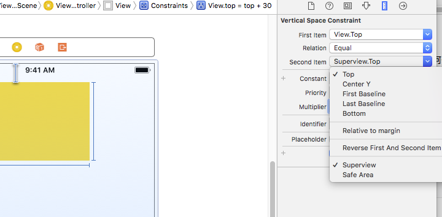
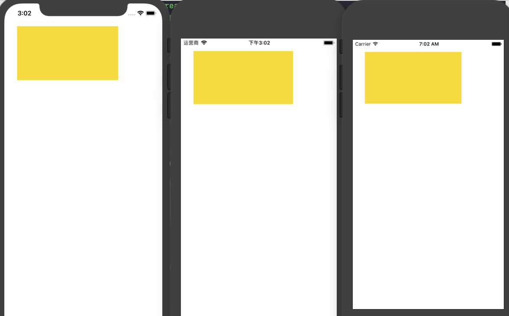
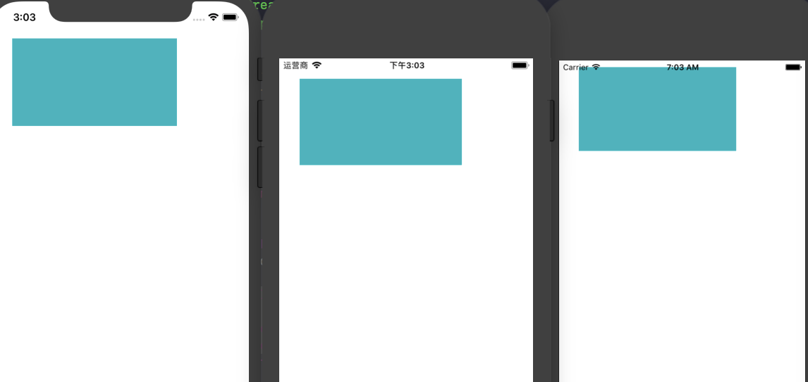
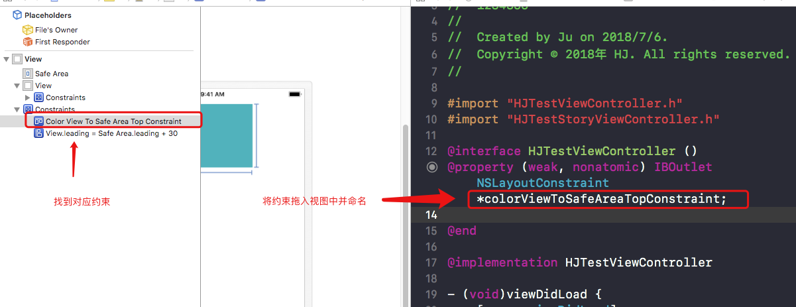
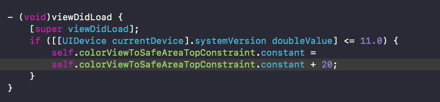
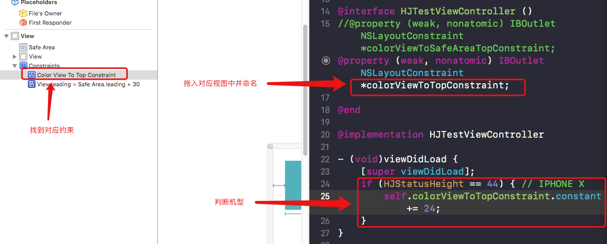
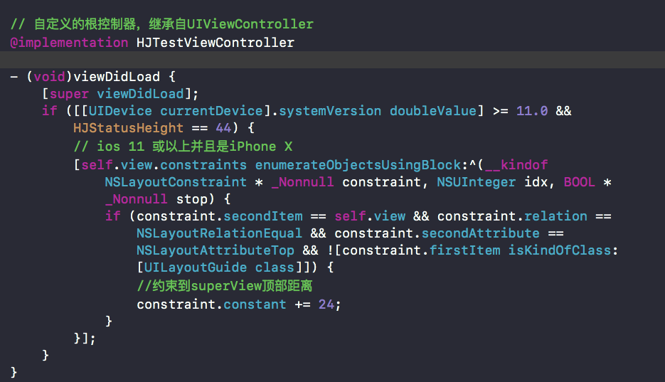

刘海，让人既爱又恨，爱的是它的刁蛮，它的任性，恨得是需要去做适配，你得去配合它，配合好了才会好看，才显得刘海如此之美。

iPhone X的适配，其实并没有那么复杂，总的来说就是代码的适配和xib的适配，首先需要知道安全区域这一概念，在iPhone X上安全区域到顶部距离是44，安全区域到底部距离是34；目前其它机型上安全区域到顶部是0(iOS 11 之后为 20)，安全区域到底部是0，如图所示：



### 代码适配

在知道了安全区域这一概念之后，通过代码去做适配就非常简单了，只需要定义几个宏，应用到frame和masonry当中就可完成

##### 1、导航栏的高度

在项目开发中通常是自定义导航栏，导航栏的高度设置为64，在iPhone X的手机上便会出现问题，刘海会挡住部分信息，原因是iPhone X状态栏返回的高度是44，而目前其他机型上返回的高度是20，导航栏的问题便解决。宏定义如代码所示：

```
//iphone  X上返回 44, 其他返回20 (根据机型返回不同的值)
#define HJStatusHeight (CGSizeEqualToSize(CGSizeMake(375.f, 812.f), [UIScreen mainScreen].bounds.size) || \
                       CGSizeEqualToSize(CGSizeMake(812.f, 375.f), [UIScreen mainScreen].bounds.size) \
                       ? (44) : (20))
//导航栏的高度
#define HJNavigationBarHeight  (44 + HJStatusHeight)

```

##### 2、安全区域到顶部与底部的距离

目前判断 iPhone X 与其他机型有3种方法

第一种：根据屏幕的尺寸来做判断，缺点是以后出现相同尺寸的机型就无法判断

第二种：通过"sysctlbyname"去获取手机设备型号，缺点是模拟器无法获取到设备型号

第三种：通过获取到状态栏高度来进行判断，缺点是以后出现相同的状态栏高度就无法判断，状态栏隐藏也无法判断

```
//iphone X 34, 其他0
#define HJSafeAreaBottomHeight ((HJStatusHeight) == (44) ? (34) : (0))
//iphone X 44, 其他0
#define HJSafeAreaTopHeight ((HJStatusHeight) == (44) ? (HJStatusHeight) : (0))
```

### storyboard 与 xib 适配

找到之前任何一个未做适配的xib，如图进行操作，勾选上 "Use Safe Area Layout Guides"。如图所示：



选择需要适配的视图，双击约束，如图所示：



到Superview修改成到Safe Area，Constant可以修改值来调整距离(此处Constant值修改为10)，如图所示：



好像适配就是如此的简单，美滋滋，不要着急，先运行看看视图在 "11" 的系统和 "11" 一下的系统，以及iPhone X上是否会发生变化




黄色视图是是放在storyboard上的，绿色视图是放在xib上的。手机型号从左到右依次为 iPhone X 11系统、iPhone 7 11系统、iPhone 7 10系统，storyboard美滋滋，没有任何问题，xib适配就出现了错误。

为何 xib 会出现这种适配错误呢，原因在于 "ios 11"以下的系统可以理解为并没有安全距离这一概念，所以可以直接把约束理解为到父视图的距离为 "10"，便出现了无法适配的情况。那么该如何解决？解决方法有很多，这里提供两种

第一种：找到项目以前会出问题的xib，统一将到superview改成到safe area，将约束拖入对应视图中，判断是ios 10 的系统，就将约束的constant的值 + 20。

第二种：找到项目以前会出问题的xib，将到superview顶部距离约束拖入对应视图中，判断是 iPhone X，就将约束的constant的值 + 24。

第三种：若项目的控制器大多都继承自一个控制器，那么不需要将到superview的顶部距离修改为到safe area顶部距离，直接在根控制器的viewDidLoad中找到约束，判断若系统是ios11，并且是iPhone X，就将constant的值 + 24。这样便将大多数的控制器进行了适配。后续只需要找到没继承根控制器的xib修改(选择第一种或者第二种)即可。

三种方法中，如果以前的项目已经足够的成熟，修改量最少的就是第三种，但这也不得不放弃 safe area，以后的xib只要控制器继承至项目所封装的根控制器，也只能用 "视图到superview顶部的距离" 约束，不能再使用 "视图到safe area顶部的距离" 约束。


##### 三种解决方案实现

第一种解决方案：




第二种解决方案：



第三种解决方案:



> Safe Area 是该拥抱还是放弃？会给出更多的答案。

