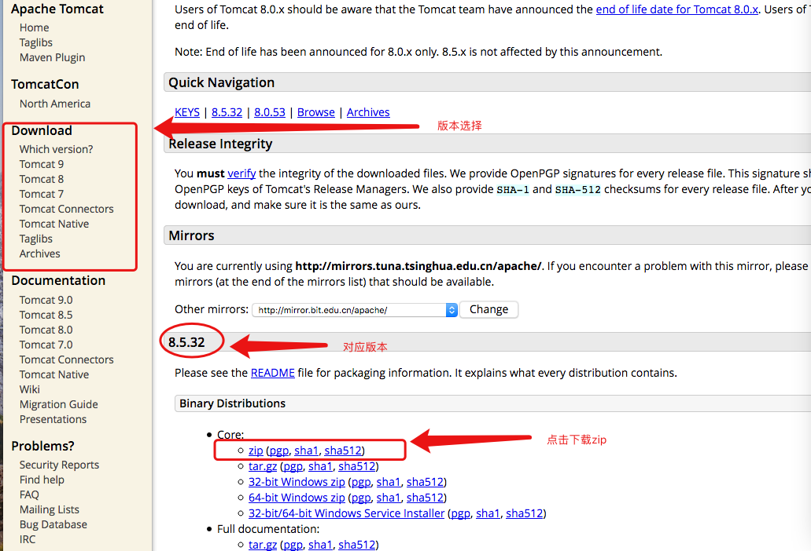
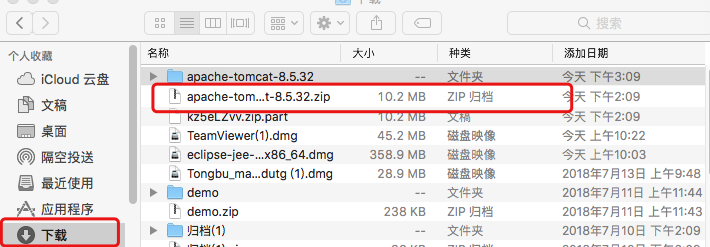
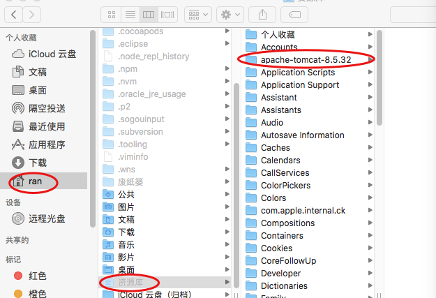
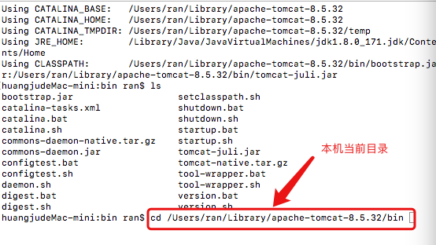
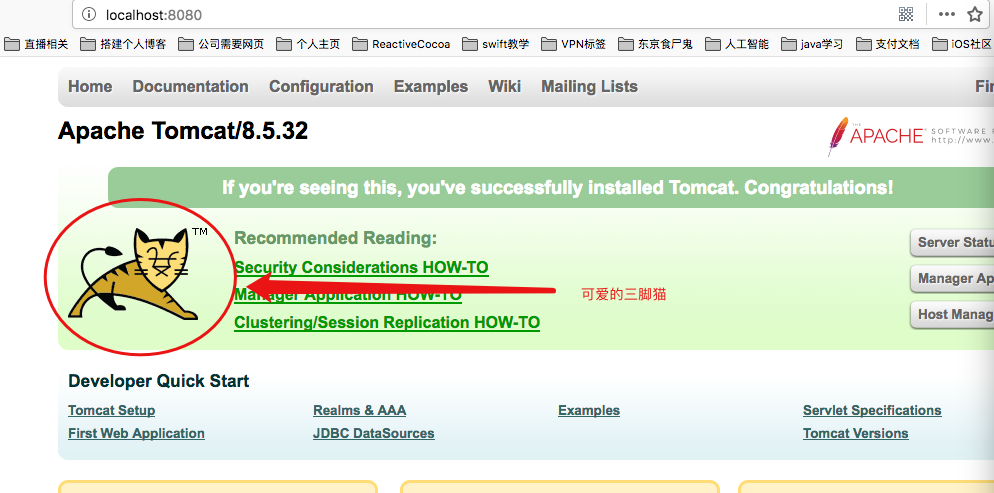
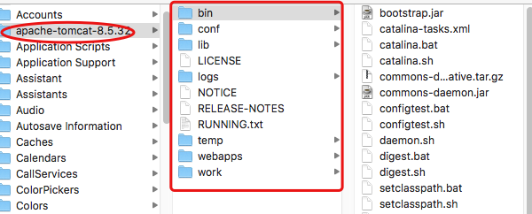
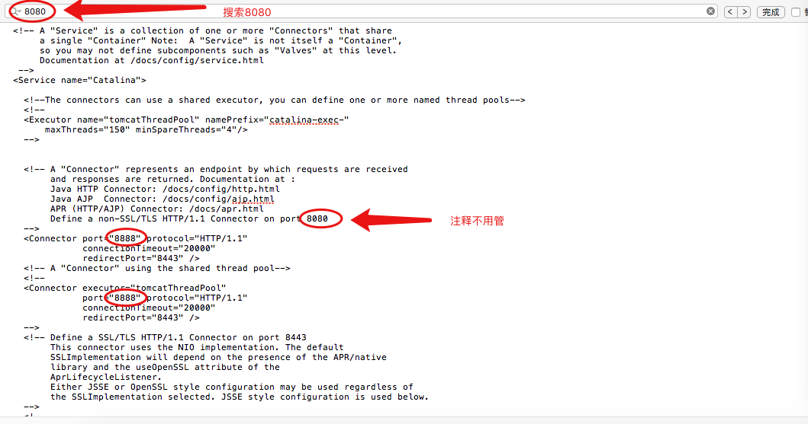
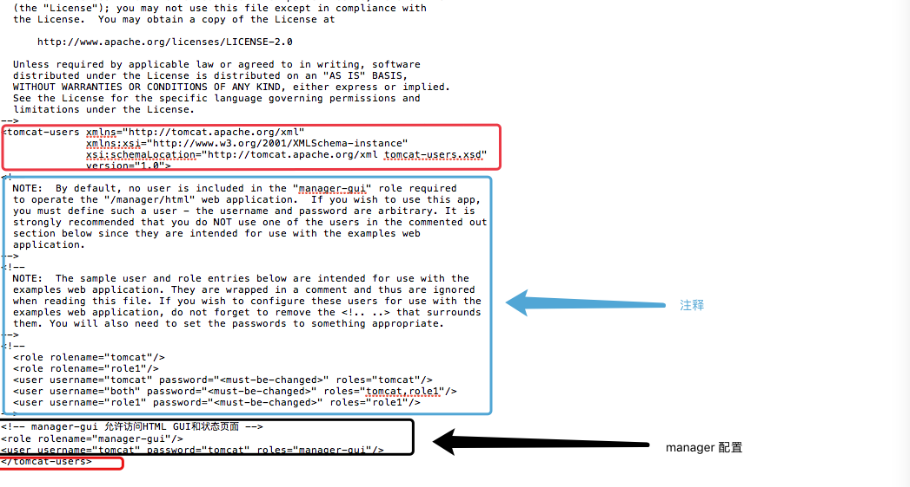
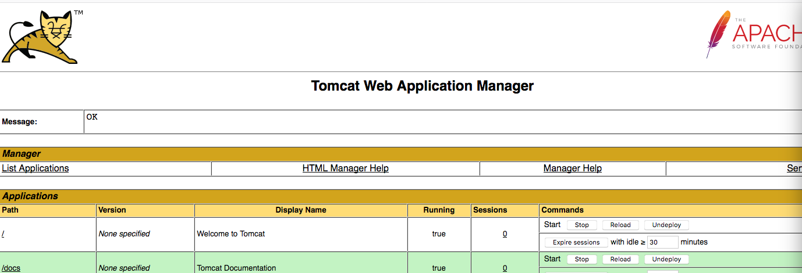

### 安装Tomcat

1、Tomcat的下载

> [Tomcat下载地址](http://tomcat.apache.org/download-80.cgi)

2、在下载位置找到下载的apache-tomcat的zip文件并解压

3、将解压出的文件夹移动到资源库文件夹下

显示隐藏文件夹快捷键：shift + command + . 

### 启动Tomcat

1、打开终端进入"apache-tomcat-8.5.32"所在目录下的bin文件夹

2、执行指令启动Tomcat

> ./startup.sh

如果出现错误提示："-bash: ./startup.sh: Permission denied"，代表用户没有权限，那么去修改bin目录下的".sh"权限并再次执行启动Tomcat

> chmod u+x *.sh

修改权限成功重新启动Tomcat

> ./startup.sh

启动成功之后验证Tomcat是否启动成功，打开浏览器输入http://localhost:8080，当发现一只三条腿的猫，Tomcat启动成功

3、执行命令管理Tomcat

> ./shutdown.sh

### 配置Tomcat

1、了解 apache-tomcat 目录

>  bin文件夹：用于存放Tomcat命令
> 
>  conf文件夹：用于存放Tomcat众多配置，需要关注server.xml文件与tomcat-users.xml文件
> 
>  lib文件夹：用于存放支撑Tomcat运行的jar包
> 
>  logs文件夹：保存运行时的日志
> 
>  temp文件夹：临时文件夹
> 
>  webapps文件夹：web应用目录
> 
>  work文件夹：Tomcat的运行目录

2、修改端口号

默认的服务起端口号是8080，为了避免与其他系统端口冲突，可以修改端口号，在server.xml文件中修改

修改之后启动Tomcat，启动前先关闭Tomcat，打开浏览器输入"http://localhost:8080"就会链接失败，输入"http://localhost:8888"便成功

3、修改 manager

在未修改 conf 目录下的tomcat-users.xml文件前是没办法登录manager的，所以需要对tomcat-users.xml文件进行权限修改

保存修改之后需要启动Tomcat，启动前先关闭Tomcat，浏览器输入"http://localhost:8888"到Tomcat主页，点击右侧"Manager App"，输入设置的账号和密码 "tomcat"便登录

